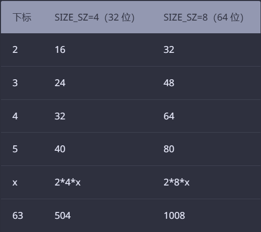

参考:
[ctfwiki](https://ctf-wiki.org/pwn/linux/user-mode/heap/ptmalloc2/heap-structure/)
[glibc内存管理](./glibc内存管理.pdf)

# 前言
必须得学扎实!

# 微观结构
## malloc_chunk
### 概述
malloc申请的内存为chunk 这块内存在ptmalloc内部用malloc_chunk结构体表示
当程序申请的 chunk 被 free 后，会被加入到相应的空闲管理列表中。
**无论一个chunk大小如何，处于分配状态还是释放状态，它们都会使用一个统一的结构**

**malloc_chunk结构**:
```c++
/*
  This struct declaration is misleading (but accurate and necessary).
  It declares a "view" into memory allowing access to necessary
  fields at known offsets from a given base. See explanation below.
*/
struct malloc_chunk {

  INTERNAL_SIZE_T      prev_size;  /* Size of previous chunk (if free).  */
  INTERNAL_SIZE_T      size;       /* Size in bytes, including overhead. */

  struct malloc_chunk* fd;         /* double links -- used only if free. */
  struct malloc_chunk* bk;

  /* Only used for large blocks: pointer to next larger size.  */
  struct malloc_chunk* fd_nextsize; /* double links -- used only if free. */
  struct malloc_chunk* bk_nextsize;
};
```

每个字段的具体解释:
- **prev_size**，如果该chunk的**物理相邻**的前一地址chunk(两个指针的差值为前一个chunk的大小)是空闲的话，
 那该字段记录的是前一个chunk的大小(包括chunk头)，若非空闲，该字段可以用来存储物理相邻前一个chunk的数据
  前一chunk:**较低地址**的chunk
- **size**，该chunk的大小，大小必须是`2*SIZE_SZ`的整数倍 若不是则会被转换为最小的满足`2*SIZE_SZ`整数倍的大小    32位 SIZE_SZ=4 64位 SIZE_SZ=8
 该字段的低三比特对chunk大小没有影响(对齐) 从高到低分别表示:
  - NON_MAIN_ARENA，记录当前 chunk 是否不属于主线程，1 表示不属于，0 表示属于。
  - IS_MAPPED，记录当前 chunk 是否是由 mmap 分配的。
  - PREV_INUSE，记录前一个 chunk 块是否被分配。一般来说，堆中第一个被分配的内存块的 size 字段的 P 位都会被设置为 1，以便于防止访问前面的非法内存。当一个 chunk 的 size 的 P 位为 0 时，我们能通过 prev_size 字段来获取上一个 chunk 的大小以及地址。这也方便进行空闲 chunk 之间的合并。
- **fd,bk** 
 chunk处于分配状态时 **从fd段开始是用户的数据**
   chunk处于空闲状态时 会被添加到对应的空闲管理链表中 其字段含义:
  - fd 指向下一个(**非**物理相邻)空闲的chunk
  - bk 指向上一个(**非**物理相邻)空闲的chunk
  - 通过fd,bk 可以将空闲的chunk加入到空闲的chunk块链表进行统一管理
- **fd_nextsize,bk_nextsize** 也是只有chunk空闲的时候才使用 只是用于较大的chunk(large chunk)
 - fd_nextsize 指向前一个与当前chunk大小不同的第一个空闲块 不包含bin的头指针 (?)
 - bk_nextsize 指向后一个与当前chunk大小不同的第一个空闲块 不包含bin的头指针
 - 一般空闲的 large chunk 在 fd 的遍历顺序中，按照由大到小的顺序排列。这样做可以避免在寻找合适 chunk 时挨个遍历。


一个已经分配的chunk的样子如下:
```c
chunk-> +-+-+-+-+-+-+-+-+-+-+-+-+-+-+-+-+-+-+-+-+-+-+-+-+-+-+-+-+-+-+-+-+
        |             Size of previous chunk, if unallocated (P clear)  |
        +-+-+-+-+-+-+-+-+-+-+-+-+-+-+-+-+-+-+-+-+-+-+-+-+-+-+-+-+-+-+-+-+
        |             Size of chunk, in bytes                     |A|M|P|
  mem-> +-+-+-+-+-+-+-+-+-+-+-+-+-+-+-+-+-+-+-+-+-+-+-+-+-+-+-+-+-+-+-+-+
        |             User data starts here...                          .
        .                                                               .
        .             (malloc_usable_size() bytes)                      .
next    .                                                               |
chunk-> +-+-+-+-+-+-+-+-+-+-+-+-+-+-+-+-+-+-+-+-+-+-+-+-+-+-+-+-+-+-+-+-+
        |             (size of chunk, but used for application data)    |
        +-+-+-+-+-+-+-+-+-+-+-+-+-+-+-+-+-+-+-+-+-+-+-+-+-+-+-+-+-+-+-+-+
        |             Size of next chunk, in bytes                |A|0|1|
        +-+-+-+-+-+-+-+-+-+-+-+-+-+-+-+-+-+-+-+-+-+-+-+-+-+-+-+-+-+-+-+-+
```

称前两个字段为chunk header 后面部分为user data
**每次malloc申请得到的内存指针都指向userdata的起始处**

当一个chunk处于使用状态时 它的下一个chunk的prev_size域无效(不记录size) 所以下一个chunk的prev_size部分可以被当前这个chunk使用
即 chunk的空间复用

被释放的chunk被记录在链表中 具体结构如下:
```c
chunk-> +-+-+-+-+-+-+-+-+-+-+-+-+-+-+-+-+-+-+-+-+-+-+-+-+-+-+-+-+-+-+-+-+
        |             Size of previous chunk, if unallocated (P clear)  |
        +-+-+-+-+-+-+-+-+-+-+-+-+-+-+-+-+-+-+-+-+-+-+-+-+-+-+-+-+-+-+-+-+
`head:' |             Size of chunk, in bytes                     |A|0|P|
  mem-> +-+-+-+-+-+-+-+-+-+-+-+-+-+-+-+-+-+-+-+-+-+-+-+-+-+-+-+-+-+-+-+-+
        |             Forward pointer to next chunk in list             |
        +-+-+-+-+-+-+-+-+-+-+-+-+-+-+-+-+-+-+-+-+-+-+-+-+-+-+-+-+-+-+-+-+
        |             Back pointer to previous chunk in list            |
        +-+-+-+-+-+-+-+-+-+-+-+-+-+-+-+-+-+-+-+-+-+-+-+-+-+-+-+-+-+-+-+-+
        |             Unused space (may be 0 bytes long)                .
        .                                                               .
 next   .                                                               |
chunk-> +-+-+-+-+-+-+-+-+-+-+-+-+-+-+-+-+-+-+-+-+-+-+-+-+-+-+-+-+-+-+-+-+
`foot:' |             Size of chunk, in bytes                           |
        +-+-+-+-+-+-+-+-+-+-+-+-+-+-+-+-+-+-+-+-+-+-+-+-+-+-+-+-+-+-+-+-+
        |             Size of next chunk, in bytes                |A|0|0|
        +-+-+-+-+-+-+-+-+-+-+-+-+-+-+-+-+-+-+-+-+-+-+-+-+-+-+-+-+-+-+-+-+
```

可知如果一个chunk处于free状态 会有两个位置记录其大小:
- 本身的size字段
- 后面的chunk的prev_size字段

**一般情况下**, **物理相邻**的两个空闲chunk会被合并成一个chunk 堆管理器通过prev_size字段以及size字段合并两个物理地址相邻的空闲chunk块

一些关于堆的约束:
```
/*
    The three exceptions to all this are:
     1. The special chunk `top' doesn't bother using the
    trailing size field since there is no next contiguous chunk
    that would have to index off it. After initialization, `top'
    is forced to always exist.  If it would become less than
    MINSIZE bytes long, it is replenished.
     2. Chunks allocated via mmap, which have the second-lowest-order
    bit M (IS_MMAPPED) set in their size fields.  Because they are
    allocated one-by-one, each must contain its own trailing size
    field.  If the M bit is set, the other bits are ignored
    (because mmapped chunks are neither in an arena, nor adjacent
    to a freed chunk).  The M bit is also used for chunks which
    originally came from a dumped heap via malloc_set_state in
    hooks.c.
     3. Chunks in fastbins are treated as allocated chunks from the
    point of view of the chunk allocator.  They are consolidated
    with their neighbors only in bulk, in malloc_consolidate.
*/
```

### chunk相关宏
chunk大小 对齐检查 以及一些转换的宏

**chunk与mem指针头部的转换**
mem指向userdata处
```c
/* conversion from malloc headers to user pointers, and back */
#define chunk2mem(p) ((void *) ((char *) (p) + 2 * SIZE_SZ))
#define mem2chunk(mem) ((mchunkptr)((char *) (mem) -2 * SIZE_SZ))
```

**最小的chunk大小**
```c
/* The smallest possible chunk */
#define MIN_CHUNK_SIZE (offsetof(struct malloc_chunk, fd_nextsize))
```
这里的`offsetof`函数算出fd_nextsize在malloc_chunk中的偏移 说明最小的chunk至少要包括bk指针(fd_nextsize前)

**最小申请的堆内存大小**
用户最小申请的堆内存大小必须是`2*SIZE_SZ`的最小整数倍
```c
/* The smallest size we can malloc is an aligned minimal chunk */
//MALLOC_ALIGN_MASK = 2 * SIZE_SZ -1
#define MINSIZE                                                                \
    (unsigned long) (((MIN_CHUNK_SIZE + MALLOC_ALIGN_MASK) &                   \
                      ~MALLOC_ALIGN_MASK))
```

**检查分配给用户的内存是否对齐**
`2*SIZE_SZ`大小对齐
```c
/* Check if m has acceptable alignment */
// MALLOC_ALIGN_MASK = 2 * SIZE_SZ -1
#define aligned_OK(m) (((unsigned long) (m) & MALLOC_ALIGN_MASK) == 0)

#define misaligned_chunk(p)                                                    \
    ((uintptr_t)(MALLOC_ALIGNMENT == 2 * SIZE_SZ ? (p) : chunk2mem(p)) &       \
     MALLOC_ALIGN_MASK)
```

**请求字节数判断**
```c
/*
   Check if a request is so large that it would wrap around zero when
   padded and aligned. To simplify some other code, the bound is made
   low enough so that adding MINSIZE will also not wrap around zero.
 */

#define REQUEST_OUT_OF_RANGE(req)                                              \
    ((unsigned long) (req) >= (unsigned long) (INTERNAL_SIZE_T)(-2 * MINSIZE))
```

**将用户请求内存大小转为实际分配内存大小**
```c
/* pad request bytes into a usable size -- internal version */
//MALLOC_ALIGN_MASK = 2 * SIZE_SZ -1
#define request2size(req)                                                      \
    (((req) + SIZE_SZ + MALLOC_ALIGN_MASK < MINSIZE)                           \
         ? MINSIZE                                                             \
         : ((req) + SIZE_SZ + MALLOC_ALIGN_MASK) & ~MALLOC_ALIGN_MASK)

/*  Same, except also perform argument check */

#define checked_request2size(req, sz)                                          \
    if (REQUEST_OUT_OF_RANGE(req)) {                                           \
        __set_errno(ENOMEM);                                                   \
        return 0;                                                              \
    }                                                                          \
    (sz) = request2size(req);
```

chunk间复用(下一个chunk的prev_size段)的流程:
1. 首先利用`REQUEST_OUT_OF_RANGE`可以判断是否可以分配用户请求的字节大小的chunk
2. 其次，需要注意的是用户请求的字节是用来存储数据的，即 chunk header 后面的部分。
 与此同时，由于 chunk 间复用，所以可以使用下一个 chunk 的prev_size 字段。
    因此，这里只需要再添加 SIZE_SZ 大小即可以完全存储内容。
3. 由于系统中所允许的申请的 chunk 最小是 MINSIZE，所以与其进行比较。
 如果不满足最低要求，那么就需要直接分配 MINSIZE 字节。
4. 如果大于的话，因为系统中申请的 chunk 需要 2 * SIZE_SZ 对齐，
 所以这里需要加上 MALLOC_ALIGN_MASK 以便于对齐。

**标记位相关**
```c
/* size field is or'ed with PREV_INUSE when previous adjacent chunk in use */
#define PREV_INUSE 0x1

/* extract inuse bit of previous chunk */
#define prev_inuse(p) ((p)->mchunk_size & PREV_INUSE)

/* size field is or'ed with IS_MMAPPED if the chunk was obtained with mmap() */
#define IS_MMAPPED 0x2

/* check for mmap()'ed chunk */
#define chunk_is_mmapped(p) ((p)->mchunk_size & IS_MMAPPED)

/* size field is or'ed with NON_MAIN_ARENA if the chunk was obtained
   from a non-main arena.  This is only set immediately before handing
   the chunk to the user, if necessary.  */
#define NON_MAIN_ARENA 0x4

/* Check for chunk from main arena.  */
#define chunk_main_arena(p) (((p)->mchunk_size & NON_MAIN_ARENA) == 0)

/* Mark a chunk as not being on the main arena.  */
#define set_non_main_arena(p) ((p)->mchunk_size |= NON_MAIN_ARENA)

/*
   Bits to mask off when extracting size
   Note: IS_MMAPPED is intentionally not masked off from size field in
   macros for which mmapped chunks should never be seen. This should
   cause helpful core dumps to occur if it is tried by accident by
   people extending or adapting this malloc.
 */
#define SIZE_BITS (PREV_INUSE | IS_MMAPPED | NON_MAIN_ARENA)
```

**获取chunk size**
```c
/* Get size, ignoring use bits */
#define chunksize(p) (chunksize_nomask(p) & ~(SIZE_BITS))

/* Like chunksize, but do not mask SIZE_BITS.  */
#define chunksize_nomask(p) ((p)->mchunk_size)
```

**获取下一个物理相邻的chunk**
```c
/* Ptr to next physical malloc_chunk. */
#define next_chunk(p) ((mchunkptr)(((char *) (p)) + chunksize(p)))
```

**获取前一个chunk的信息**
```c
/* Size of the chunk below P.  Only valid if !prev_inuse (P).  */
#define prev_size(p) ((p)->mchunk_prev_size)

/* Set the size of the chunk below P.  Only valid if !prev_inuse (P).  */
#define set_prev_size(p, sz) ((p)->mchunk_prev_size = (sz))

/* Ptr to previous physical malloc_chunk.  Only valid if !prev_inuse (P).  */
#define prev_chunk(p) ((mchunkptr)(((char *) (p)) - prev_size(p)))
```

**当前 chunk 使用状态相关操作**
```c
/* extract p's inuse bit */
#define inuse(p)                                                               \
    ((((mchunkptr)(((char *) (p)) + chunksize(p)))->mchunk_size) & PREV_INUSE)

/* set/clear chunk as being inuse without otherwise disturbing */
#define set_inuse(p)                                                           \
    ((mchunkptr)(((char *) (p)) + chunksize(p)))->mchunk_size |= PREV_INUSE

#define clear_inuse(p)                                                         \
    ((mchunkptr)(((char *) (p)) + chunksize(p)))->mchunk_size &= ~(PREV_INUSE)
```

**设置 chunk 的 size 字段**
```c
/* Set size at head, without disturbing its use bit */
// SIZE_BITS = 7
#define set_head_size(p, s)                                                    \
    ((p)->mchunk_size = (((p)->mchunk_size & SIZE_BITS) | (s)))

/* Set size/use field */
#define set_head(p, s) ((p)->mchunk_size = (s))

/* Set size at footer (only when chunk is not in use) */
#define set_foot(p, s)                                                         \
    (((mchunkptr)((char *) (p) + (s)))->mchunk_prev_size = (s))
```

**获取指定偏移的 chunk**
```c
/* Treat space at ptr + offset as a chunk */
#define chunk_at_offset(p, s) ((mchunkptr)(((char *) (p)) + (s)))
```

**指定偏移处 chunk 使用状态相关操作**
```c
/* check/set/clear inuse bits in known places */
#define inuse_bit_at_offset(p, s)                                              \
    (((mchunkptr)(((char *) (p)) + (s)))->mchunk_size & PREV_INUSE)

#define set_inuse_bit_at_offset(p, s)                                          \
    (((mchunkptr)(((char *) (p)) + (s)))->mchunk_size |= PREV_INUSE)

#define clear_inuse_bit_at_offset(p, s)                                        \
    (((mchunkptr)(((char *) (p)) + (s)))->mchunk_size &= ~(PREV_INUSE))
```

C写的真的好优雅~! (优雅的让我准备抽时间读一遍Kernighan的C·Programming·Language)

## bin
重点来了

### 概述
用户释放的chunk不会马上归还给系统 ptmalloc会统一管理heap和mmap映射区域中空闲的chunk
当用户再一次请求分配内存时 ptmalloc分配器会试图在空闲的chunk挑选一块合适的给用户
这样可以避免频繁的系统调用 降低内存分配的开销

具体实现中 ptmalloc采用分箱式方法对空闲的chunk进行管理
首先会根据空闲的chunk大小以及使用状态将chunk初步分为4类:
**fast bins**  **small bins**   **large bins**  **unsorted bin**
每类中仍有更细的划分 相似大小的chunk会用双向链表链接起来
即 每类bin的内部仍然会有多个互不相关的链表来保存不同大小的chunk

对于 `small bins` ,`large bins` ,`unsorted bin` 来说 ptmalloc将它们维护在同一个数组中
这些bin对应的数据结构在malloc_state中:
```c
#define NBINS 128
/* Normal bins packed as described above */
mchunkptr bins[ NBINS * 2 - 2 ];
```
`bins`主要用于索引不同bin的fd 和 bk

为了简化在双链接列表中的使用 每个bin的header都设置为`malloc_chunk`类型 这样可以避免header类型特殊处理
但为了节省空间和提高局部性 只分配bin的fd/bk指针 然后使用`repositioning tricks`将这些指针视为一个`malloc chunk*` 字段
以32位系统为例 bins的前4项含义:


可发现bin2的prev_size,size 和bin1的fd,bk 是重合的
由于我们只用fd和bk来索引链表 所以重合部分记录的实际是bin1的fd,bk
尽管后一个bin和前一个bin共用数据 但记录的仍是前一个的数据 这种复用可以节省空间

数组中的bin:
1. 第一个为`unsorted bin` 这里面的chunk没有进行排序
2. 索引从2到63的为`small bins` 同一个`small bin`链表中的chunk大小相同
 两个相邻`small bin`链表的chunk大小相差两个机器字长 (0x8 0x16)
3. `small bins`后面的bin是`large bins`  `large bins`中的每一个bin都包含一定范围内的chunk
 其中的chunk按fd指针从大到小排序 相同大小的按最近使用顺序排列

上述bin都遵循一个原则: 任意两个**物理相邻空闲**的chunk不能在一起
然而 并不是所有的chunk free后就被放到bin中 一些小的chunk会先放到`fast bins`中
而且`fast bin`中的chunk prev_inuse总是为1 所以不满足上述原则

bin通用的宏:
```c
typedef struct malloc_chunk *mbinptr;

/* addressing -- note that bin_at(0) does not exist */
#define bin_at(m, i)                                                           \
    (mbinptr)(((char *) &((m)->bins[ ((i) -1) * 2 ])) -                        \
              offsetof(struct malloc_chunk, fd))

/* analog of ++bin */
//获取下一个bin的地址
#define next_bin(b) ((mbinptr)((char *) (b) + (sizeof(mchunkptr) << 1)))

/* Reminders about list directionality within bins */
// 这两个宏可以用来遍历bin
// 获取 bin 的位于链表头的 chunk
#define first(b) ((b)->fd)
// 获取 bin 的位于链表尾的 chunk
#define last(b) ((b)->bk)
```


### Fast Bin
大多数程序经常会申请以及释放一些比较小的内存块。如果将一些较小的 chunk 释放之后发现存在与之相邻的空闲的 chunk 并将它们进行合并，
那么当下一次再次申请相应大小的 chunk 时，就需要对 chunk 进行分割，这样就大大降低了堆的利用效率。
因为我们把大部分时间花在了合并、分割以及中间检查的过程中。
因此，ptmalloc 中专门设计了 fast bin，对应的变量就是 malloc state 中的 fastbinsY
```c++
/*
   Fastbins

    An array of lists holding recently freed small chunks.  Fastbins
    are not doubly linked.  It is faster to single-link them, and
    since chunks are never removed from the middles of these lists,
    double linking is not necessary. Also, unlike regular bins, they
    are not even processed in FIFO order (they use faster LIFO) since
    ordering doesn't much matter in the transient contexts in which
    fastbins are normally used.

    Chunks in fastbins keep their inuse bit set, so they cannot
    be consolidated with other free chunks. malloc_consolidate
    releases all chunks in fastbins and consolidates them with
    other free chunks.
 */
typedef struct malloc_chunk *mfastbinptr;

/*
    This is in malloc_state.
    /* Fastbins */
    mfastbinptr fastbinsY[ NFASTBINS ];

```

glibc采用**单向链表**对fastbin的每个bin进行管理
并且每个bin采取**LIFO**策略 最后释放最先使用
当用户申请的chunk大小小于fastbin的最大大小时 ptmalloc会首先看fastbin有没有对应大小的空闲块
如果有就直接从这个bin获取chunk 若否ptmalloc才会继续后续操作

以**32位**系统为例 fastbin默认的最大chunk的**数据空间**大小为64字节
但是其可支持的chunk的**数据空间**最大为**80**字节
除此之外 fastbin最多可支持的bin的个数为**10**个 从数据空间8字节开始一直到80字节(8,16,24,...,80)
注意是**数据空间**大小(除去prev_size与size段的大小)

定义如下:
```c
#define NFASTBINS (fastbin_index(request2size(MAX_FAST_SIZE)) + 1)

#ifndef DEFAULT_MXFAST
#define DEFAULT_MXFAST (64 * SIZE_SZ / 4)
#endif

/* The maximum fastbin request size we support */
#define MAX_FAST_SIZE (80 * SIZE_SZ / 4)

/*
   Since the lowest 2 bits in max_fast don't matter in size comparisons,
   they are used as flags.
 */

/*
   FASTCHUNKS_BIT held in max_fast indicates that there are probably
   some fastbin chunks. It is set true on entering a chunk into any
   fastbin, and cleared only in malloc_consolidate.

   The truth value is inverted so that have_fastchunks will be true
   upon startup (since statics are zero-filled), simplifying
   initialization checks.
 */
//判断分配区是否有 fast bin chunk，1表示没有
#define FASTCHUNKS_BIT (1U)

#define have_fastchunks(M) (((M)->flags & FASTCHUNKS_BIT) == 0)
#define clear_fastchunks(M) catomic_or(&(M)->flags, FASTCHUNKS_BIT)
#define set_fastchunks(M) catomic_and(&(M)->flags, ~FASTCHUNKS_BIT)

/*
   NONCONTIGUOUS_BIT indicates that MORECORE does not return contiguous
   regions.  Otherwise, contiguity is exploited in merging together,
   when possible, results from consecutive MORECORE calls.

   The initial value comes from MORECORE_CONTIGUOUS, but is
   changed dynamically if mmap is ever used as an sbrk substitute.
 */
// MORECORE是否返回连续的内存区域。
// 主分配区中的MORECORE其实为sbr()，默认返回连续虚拟地址空间
// 非主分配区使用mmap()分配大块虚拟内存，然后进行切分来模拟主分配区的行为
// 而默认情况下mmap映射区域是不保证虚拟地址空间连续的，所以非主分配区默认分配非连续虚拟地址空间。
#define NONCONTIGUOUS_BIT (2U)

#define contiguous(M) (((M)->flags & NONCONTIGUOUS_BIT) == 0)
#define noncontiguous(M) (((M)->flags & NONCONTIGUOUS_BIT) != 0)
#define set_noncontiguous(M) ((M)->flags |= NONCONTIGUOUS_BIT)
#define set_contiguous(M) ((M)->flags &= ~NONCONTIGUOUS_BIT)

/* ARENA_CORRUPTION_BIT is set if a memory corruption was detected on the
   arena.  Such an arena is no longer used to allocate chunks.  Chunks
   allocated in that arena before detecting corruption are not freed.  */

#define ARENA_CORRUPTION_BIT (4U)

#define arena_is_corrupt(A) (((A)->flags & ARENA_CORRUPTION_BIT))
#define set_arena_corrupt(A) ((A)->flags |= ARENA_CORRUPTION_BIT)

/*
   Set value of max_fast.
   Use impossibly small value if 0.
   Precondition: there are no existing fastbin chunks.
   Setting the value clears fastchunk bit but preserves noncontiguous bit.
 */

#define set_max_fast(s)                                                        \
    global_max_fast =                                                          \
        (((s) == 0) ? SMALLBIN_WIDTH : ((s + SIZE_SZ) & ~MALLOC_ALIGN_MASK))
#define get_max_fast() global_max_fast
```
ptmalloc 默认情况下会调用 set_max_fast(s) 将全局变量 global_max_fast 设置为 DEFAULT_MXFAST，也就是设置 fast bins 中 chunk 的最大值。
当 MAX_FAST_SIZE 被设置为 0 时，系统就不会支持 fastbin 。

**fastbin的索引**
```c
#define fastbin(ar_ptr, idx) ((ar_ptr)->fastbinsY[ idx ])

/* offset 2 to use otherwise unindexable first 2 bins */
// chunk size=2*size_sz*(2+idx)
// 这里要减2，否则的话，前两个bin没有办法索引到。
#define fastbin_index(sz)                                                      \
    ((((unsigned int) (sz)) >> (SIZE_SZ == 8 ? 4 : 3)) - 2)
```
注意 由于fastbin中的chunk的**inuse始终为1** 所以不会和其他被释放的chunk合并
但是当释放的 chunk 与该 chunk 相邻的空闲 chunk 合并后的大小大于 FASTBIN_CONSOLIDATION_THRESHOLD 时，内存碎片可能比较多了，
我们就需要把 fast bins 中的 chunk 都进行合并，以减少内存碎片对系统的影响。
```c
/*
   FASTBIN_CONSOLIDATION_THRESHOLD is the size of a chunk in free()
   that triggers automatic consolidation of possibly-surrounding
   fastbin chunks. This is a heuristic, so the exact value should not
   matter too much. It is defined at half the default trim threshold as a
   compromise heuristic to only attempt consolidation if it is likely
   to lead to trimming. However, it is not dynamically tunable, since
   consolidation reduces fragmentation surrounding large chunks even
   if trimming is not used.
 */

#define FASTBIN_CONSOLIDATION_THRESHOLD (65536UL)
```

`malloc_consolidate`函数可以将`fastbin`中所有能和其它 chunk 合并的 chunk 合并在一起。
```c
/*
    Chunks in fastbins keep their inuse bit set, so they cannot
    be consolidated with other free chunks. malloc_consolidate
    releases all chunks in fastbins and consolidates them with
    other free chunks.
 */
```

### Small Bin
small bins中每个chunk的大小与其所在的bin的index的关系: `chunk_size = 2*SIZE_SZ*index`


smallbins中一共有62个循环双向链表 每个链表中存储的chunk大小都一致
如 32位下 下标2对应的双向链表中存储的chunk大小均为16字节
每个链表都有链表头结点 便于内部节点管理
small bins中每个bin对应的链表采用**FIFO**  所以同一个链表先被释放的会先分配

small bin的相关宏:
```c
#define NSMALLBINS 64
#define SMALLBIN_WIDTH MALLOC_ALIGNMENT
// 是否需要对small bin的下标进行纠正
#define SMALLBIN_CORRECTION (MALLOC_ALIGNMENT > 2 * SIZE_SZ)

#define MIN_LARGE_SIZE ((NSMALLBINS - SMALLBIN_CORRECTION) * SMALLBIN_WIDTH)
//判断chunk的大小是否在small bin范围内
#define in_smallbin_range(sz)                                                  \
    ((unsigned long) (sz) < (unsigned long) MIN_LARGE_SIZE)
// 根据chunk的大小得到small bin对应的索引。
#define smallbin_index(sz)                                                     \
    ((SMALLBIN_WIDTH == 16 ? (((unsigned) (sz)) >> 4)                          \
                           : (((unsigned) (sz)) >> 3)) +                       \
     SMALLBIN_CORRECTION)
```

fastbin和smallbin中chunk的大小**有很大一部分重合**
**fastbin的chunk是有可能被放到small bin中的**

### Large Bin
在32位平台 >=512B的空闲chunk or 在64位平台 >=1024B的空闲chunk 由large bins管理
large bins中一共包括63个bin 每个bin中的chunk大小**不一致** 而是处于一定区间范围内
此外 这64个bin被分成了6组 每组bin中的chunk大小之间的公差一致


以32位为例 第一个large bin的起始chunk大小为512字节 位于第一组 所以该bin可存储的chunk大小范围$[512,512+64)$

关于large bin的宏如下 eg. 在32位平台下 第一个large bin的起始chunk大小为512字节 512>>6=8 所以下标是56+8=64
```c
#define largebin_index_32(sz)                                                  \
    (((((unsigned long) (sz)) >> 6) <= 38)                                     \
         ? 56 + (((unsigned long) (sz)) >> 6)                                  \
         : ((((unsigned long) (sz)) >> 9) <= 20)                               \
               ? 91 + (((unsigned long) (sz)) >> 9)                            \
               : ((((unsigned long) (sz)) >> 12) <= 10)                        \
                     ? 110 + (((unsigned long) (sz)) >> 12)                    \
                     : ((((unsigned long) (sz)) >> 15) <= 4)                   \
                           ? 119 + (((unsigned long) (sz)) >> 15)              \
                           : ((((unsigned long) (sz)) >> 18) <= 2)             \
                                 ? 124 + (((unsigned long) (sz)) >> 18)        \
                                 : 126)

#define largebin_index_32_big(sz)                                              \
    (((((unsigned long) (sz)) >> 6) <= 45)                                     \
         ? 49 + (((unsigned long) (sz)) >> 6)                                  \
         : ((((unsigned long) (sz)) >> 9) <= 20)                               \
               ? 91 + (((unsigned long) (sz)) >> 9)                            \
               : ((((unsigned long) (sz)) >> 12) <= 10)                        \
                     ? 110 + (((unsigned long) (sz)) >> 12)                    \
                     : ((((unsigned long) (sz)) >> 15) <= 4)                   \
                           ? 119 + (((unsigned long) (sz)) >> 15)              \
                           : ((((unsigned long) (sz)) >> 18) <= 2)             \
                                 ? 124 + (((unsigned long) (sz)) >> 18)        \
                                 : 126)

// XXX It remains to be seen whether it is good to keep the widths of
// XXX the buckets the same or whether it should be scaled by a factor
// XXX of two as well.
#define largebin_index_64(sz)                                                  \
    (((((unsigned long) (sz)) >> 6) <= 48)                                     \
         ? 48 + (((unsigned long) (sz)) >> 6)                                  \
         : ((((unsigned long) (sz)) >> 9) <= 20)                               \
               ? 91 + (((unsigned long) (sz)) >> 9)                            \
               : ((((unsigned long) (sz)) >> 12) <= 10)                        \
                     ? 110 + (((unsigned long) (sz)) >> 12)                    \
                     : ((((unsigned long) (sz)) >> 15) <= 4)                   \
                           ? 119 + (((unsigned long) (sz)) >> 15)              \
                           : ((((unsigned long) (sz)) >> 18) <= 2)             \
                                 ? 124 + (((unsigned long) (sz)) >> 18)        \
                                 : 126)

#define largebin_index(sz)                                                     \
    (SIZE_SZ == 8 ? largebin_index_64(sz) : MALLOC_ALIGNMENT == 16             \
                                                ? largebin_index_32_big(sz)    \
                                                : largebin_index_32(sz))
```

### Unsorted Bin
unsorted bin 可以视为空闲chunk回归其所属bin之前的缓冲区 (可以看成small bins和large bins的cache)
glibc中的说明:

```c
/*
   Unsorted chunks

    All remainders from chunk splits, as well as all returned chunks,
    are first placed in the "unsorted" bin. They are then placed
    in regular bins after malloc gives them ONE chance to be used before
    binning. So, basically, the unsorted_chunks list acts as a queue,
    with chunks being placed on it in free (and malloc_consolidate),
    and taken off (to be either used or placed in bins) in malloc.

    The NON_MAIN_ARENA flag is never set for unsorted chunks, so it
    does not have to be taken into account in size comparisons.
 */
```

有如下的宏:
```c
/* The otherwise unindexable 1-bin is used to hold unsorted chunks. */
#define unsorted_chunks(M) (bin_at(M, 1))
```
可以发现unsorted bin处于bin数组下标1处 故unsorted bin只有一个链表
unsorted bin中的空闲chunk处于乱序状态 主要有两个来源:
- 当一个较大的chunk被分隔成两半后 若剩下的部分大于`MINSIZE` 就会被放到unsorted bin中
- 释放一个不属于`fast bin`的chunk 并且该chunk不和top chunk相邻时 该chunk会首先被放到unsorted bin中

另 unsorted bin使用时采取**FIFO**

### common macro
一些通用的宏
**根据 chunk 的大小统一地获得 chunk 所在的索引**
```c
#define bin_index(sz)                                                          \
    ((in_smallbin_range(sz)) ? smallbin_index(sz) : largebin_index(sz))
```

## Top Chunk
glibc中的描述:
```c
/*
   Top

    The top-most available chunk (i.e., the one bordering the end of
    available memory) is treated specially. It is never included in
    any bin, is used only if no other chunk is available, and is
    released back to the system if it is very large (see
    M_TRIM_THRESHOLD).  Because top initially
    points to its own bin with initial zero size, thus forcing
    extension on the first malloc request, we avoid having any special
    code in malloc to check whether it even exists yet. But we still
    need to do so when getting memory from system, so we make
    initial_top treat the bin as a legal but unusable chunk during the
    interval between initialization and the first call to
    sysmalloc. (This is somewhat delicate, since it relies on
    the 2 preceding words to be zero during this interval as well.)
 */

/* Conveniently, the unsorted bin can be used as dummy top on first call */
#define initial_top(M) (unsorted_chunks(M))
```
程序第一次进行malloc的时候 heap会被分成两块 一块给user 剩下的就是top chunk
topchunk就是处于当前堆**最高物理地址**的chunk 不属于任何一个bin
**作用**: 当所有的bin都无法满足用户请求chunk的大小时
如果其大小不小于指定的大小 就进行分配 并将剩下部分作为新的topchunk
若否就对heap进行扩展后再进行分配 (在`main arena`通过sbrk扩展heap 而在`thread arena`通过mmap分配新的heap)

注意 top chunk的`prev_inuse`比特位始终为1 否则前面(低地址)的chunk就会被合并到top chunk中
初始情况下 可以将unsorted chunk作为top chunk (initial_top宏)

## last remainder
在用户使用 malloc 请求分配内存时，ptmalloc2 找到的 chunk 可能并不和申请的内存大小一致，
这时候就将分割之后的剩余部分称之为`last remainder chunk`，unsorted bin 也会存这一块。
top chunk 分割剩下的部分不会作为 last remainder.


# 宏观结构

## arena

### arena数量
对不同系统 arena数量的约束:
```c
For 32 bit systems:
     Number of arena = 2 * number of cores.
For 64 bit systems:
     Number of arena = 8 * number of cores.
```

### 区别
与`thread`不同 main_arena并不在申请的heap中 而是一个全局变量 在libc的data段

## heap_info
程序刚开始执行时，每个线程是没有 heap 区域的。
当其申请内存时，就需要一个结构来记录对应的信息，而 heap_info 的作用就是这个。
而且当该 heap 的资源被使用完后，就必须得再次申请内存了。
此外，一般申请的 heap 是不连续的，因此需要记录不同 heap 之间的链接结构。
该数据结构是专门为从 Memory Mapping Segment 处申请的内存准备的，即为非主线程准备的。

主线程可以通过`sbrk()`函数扩展`program break location`获得(直到触及`Memory Mapping Segment`) 只有一个heap 没有heap_info结构

`heap_info`的主要结构:
```c
#define HEAP_MIN_SIZE (32 * 1024)
#ifndef HEAP_MAX_SIZE
# ifdef DEFAULT_MMAP_THRESHOLD_MAX
#  define HEAP_MAX_SIZE (2 * DEFAULT_MMAP_THRESHOLD_MAX)
# else
#  define HEAP_MAX_SIZE (1024 * 1024) /* must be a power of two */
# endif

/* HEAP_MIN_SIZE and HEAP_MAX_SIZE limit the size of mmap()ed heaps
   that are dynamically created for multi-threaded programs.  The
   maximum size must be a power of two, for fast determination of
   which heap belongs to a chunk.  It should be much larger than the
   mmap threshold, so that requests with a size just below that
   threshold can be fulfilled without creating too many heaps.  */

/***************************************************************************/

/* A heap is a single contiguous memory region holding (coalesceable)
   malloc_chunks.  It is allocated with mmap() and always starts at an
   address aligned to HEAP_MAX_SIZE.  */

typedef struct _heap_info
{
  mstate ar_ptr; /* Arena for this heap. */
  struct _heap_info *prev; /* Previous heap. */
  size_t size;   /* Current size in bytes. */
  size_t mprotect_size; /* Size in bytes that has been mprotected
                           PROT_READ|PROT_WRITE.  */
  /* Make sure the following data is properly aligned, particularly
     that sizeof (heap_info) + 2 * SIZE_SZ is a multiple of
     MALLOC_ALIGNMENT. */
  char pad[-6 * SIZE_SZ & MALLOC_ALIGN_MASK];
} heap_info;
```

这个结构描述堆的基本信息:
- 堆对应的`arena`地址
- prev记录上一个heap_info的地址 每个堆的heap_info通过单向链表链接
- size表示当前堆的大小
- 确保对齐
关于pad里面的负数:
`pad`是确保分配的空间按照`MALLOC_ALIGN_MASK+1`(`MALLOC_ALIGN_MASK_1`)对齐
在pad之前该结构体共有6个(??)`SIZE_SZ`大小的成员 设最后大小:`MALLOC_ALIGN_MASK_1*x`
那么需要pad的大小为 
`MALLOC_ALIGN_MASK_1*x - 6*SIZE_SZ = (MALLOC_ALIGN_MASK_1*x - 6*SIZE_SZ)%MALLOC_ALIGN_MASK_1 = -6*SIZE_SZ & MALLOC_ALIGN_MASK`

## malloc_state
该结构用于管理堆，记录每个 arena 当前申请的内存的具体状态，比如说是否有空闲 chunk，有什么大小的空闲 chunk 等等。
无论是 thread arena 还是 main arena，它们都只有一个 malloc state 结构。
由于 thread 的 arena 可能有多个，malloc state 结构会在最新申请的 arena 中。

注意 **main_arena**的malloc_state不是heap segement的一部分 而是一个**全局变量** 存储在libc的data段

`malloc_state`结构:
```c
struct malloc_state {
    /* Serialize access.  */
    __libc_lock_define(, mutex);

    /* Flags (formerly in max_fast).  */
    int flags;

    /* Fastbins */
    mfastbinptr fastbinsY[ NFASTBINS ];

    /* Base of the topmost chunk -- not otherwise kept in a bin */
    mchunkptr top;

    /* The remainder from the most recent split of a small request */
    mchunkptr last_remainder;

    /* Normal bins packed as described above */
    mchunkptr bins[ NBINS * 2 - 2 ];

    /* Bitmap of bins, help to speed up the process of determinating if a given bin is definitely empty.*/
    unsigned int binmap[ BINMAPSIZE ];

    /* Linked list, points to the next arena */
    struct malloc_state *next;

    /* Linked list for free arenas.  Access to this field is serialized
       by free_list_lock in arena.c.  */
    struct malloc_state *next_free;

    /* Number of threads attached to this arena.  0 if the arena is on
       the free list.  Access to this field is serialized by
       free_list_lock in arena.c.  */
    INTERNAL_SIZE_T attached_threads;

    /* Memory allocated from the system in this arena.  */
    INTERNAL_SIZE_T system_mem;
    INTERNAL_SIZE_T max_system_mem;
};
```

解释:
- `__libc_lock_define(, mutex);`
 该变量用于控制程序串行访问同一个分配区，当一个线程获取了分配区之后，
  其它线程要想访问该分配区，就必须等待该线程分配完成后才能够使用。

- `flags`
 flags 记录了分配区的一些标志，比如`bit0`记录了分配区是否有`fast bin chunk`,`bit1`标识分配区是否能返回连续的虚拟地址空间。
  具体如下
```c
/*
   FASTCHUNKS_BIT held in max_fast indicates that there are probably
   some fastbin chunks. It is set true on entering a chunk into any
   fastbin, and cleared only in malloc_consolidate.
   The truth value is inverted so that have_fastchunks will be true
   upon startup (since statics are zero-filled), simplifying
   initialization checks.
 */

#define FASTCHUNKS_BIT (1U)

#define have_fastchunks(M) (((M)->flags & FASTCHUNKS_BIT) == 0)
#define clear_fastchunks(M) catomic_or(&(M)->flags, FASTCHUNKS_BIT)
#define set_fastchunks(M) catomic_and(&(M)->flags, ~FASTCHUNKS_BIT)

/*
   NONCONTIGUOUS_BIT indicates that MORECORE does not return contiguous
   regions.  Otherwise, contiguity is exploited in merging together,
   when possible, results from consecutive MORECORE calls.
   The initial value comes from MORECORE_CONTIGUOUS, but is
   changed dynamically if mmap is ever used as an sbrk substitute.
 */

#define NONCONTIGUOUS_BIT (2U)

#define contiguous(M) (((M)->flags & NONCONTIGUOUS_BIT) == 0)
#define noncontiguous(M) (((M)->flags & NONCONTIGUOUS_BIT) != 0)
#define set_noncontiguous(M) ((M)->flags |= NONCONTIGUOUS_BIT)
#define set_contiguous(M) ((M)->flags &= ~NONCONTIGUOUS_BIT)

/* ARENA_CORRUPTION_BIT is set if a memory corruption was detected on the
   arena.  Such an arena is no longer used to allocate chunks.  Chunks
   allocated in that arena before detecting corruption are not freed.  */

#define ARENA_CORRUPTION_BIT (4U)

#define arena_is_corrupt(A) (((A)->flags & ARENA_CORRUPTION_BIT))
#define set_arena_corrupt(A) ((A)->flags |= ARENA_CORRUPTION_BIT)
```
这些宏大多都在前面的bin分类里提到过

- `fastbinsY[NFASTBINS]`
 存放每个`fast chunk`链表头部的指针
- `top`
 指向分配区的`top chunk`
- `last_remainder`
 最新的chunk分隔后剩下的部分
- `bins`
 用于存储unsorted bin, small bins和large bins 的chunk链表
- `binmap`
 ptmalloc用一个bit来表示某一个bin中是否包含空闲chunk