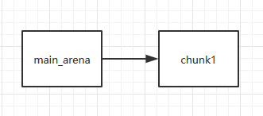

参考文章:
[pwn堆：fastbin attack详解](https://blog.csdn.net/Breeze_CAT/article/details/103788698)
[wiki](https://ctf-wiki.org/pwn/linux/user-mode/heap/ptmalloc2/fastbin-attack/)

本地写详细点 多写写自己的理解体会

# 介绍
个人理解: fastbin的单向链表机制 | 修改fd指针域

ctfwiki:
fastbin attack 是一类漏洞的利用方法，是指所有基于 fastbin 机制的漏洞利用方法。这类利用的前提是：
- 存在堆溢出、use-after-free 等能控制 chunk 内容的漏洞
- 漏洞发生于 fastbin 类型的 chunk 中

如果细分的话，可以做如下的分类：
- Fastbin Double Free
- House of Spirit
- Alloc to Stack
- Arbitrary Alloc

其中，前两种主要漏洞侧重于利用`free`函数释放真的`chunk`或伪造的`chunk`，然后再次申请`chunk`进行攻击，后两种侧重于故意修改`fd`指针，直接利用`malloc` 申请指定位置 `chunk` 进行攻击。

# 原理
堆的漏洞关键就在于ptmalloc2的管理机制
fastbin采用单链表来管理 LIFO(后释放先使用) 且fastbin管理的chunk释放后next_chunk的prev_inuse位也不会被清空

## fastbin分配流程
回顾一下fastbin结构:

可以发现是没有bk指针的(用不上) 而且prev_inuse(P)始终为1

简单了解一下(以后补充)fastbin分配流程
fastbins是管理在malloc_state结构体中的一串单向链表
分为0x20 ~ 0x80 **7**个链表 每个表头对应一个长度 **<=4**的单向链表
在不引入tcache的glibc 会优先分配fastbin对应大小的块

这张图很好阐述fastbin的链表:(应该作者画错了 fastbin的fd应该指向头部而不是userdata段，tcache才是指向userdata)


0x30这个表头(分配的开始)指向chunk1(后释放先使用)的用户可写段(fd) 然后 chunk1的fd指针指向chunk0(先一个释放后一个使用)的用户可写段
这样每个chunk的fd指针指向下一个空闲的fastbin堆块(最后一个chunk fd空)
一次分配后:


chunk0的fd被置为空 然后0x30指向chunk0原先fd指向的chunk1

用ctfwiki上的demo(本地ubuntu20.04引入tcache 一打fastbin本地全是tcache...)
demo:
```c
int main(void)
{
    void *chunk1,*chunk2,*chunk3;
    chunk1=malloc(0x30);
    chunk2=malloc(0x30);
    chunk3=malloc(0x30);
    //进行释放
    free(chunk1);
    free(chunk2);
    free(chunk3);
    return 0;
}
```
释放前:
```c
0x602000:   0x0000000000000000  0x0000000000000041 <=== chunk1
0x602010:   0x0000000000000000  0x0000000000000000
0x602020:   0x0000000000000000  0x0000000000000000
0x602030:   0x0000000000000000  0x0000000000000000
0x602040:   0x0000000000000000  0x0000000000000041 <=== chunk2
0x602050:   0x0000000000000000  0x0000000000000000
0x602060:   0x0000000000000000  0x0000000000000000
0x602070:   0x0000000000000000  0x0000000000000000
0x602080:   0x0000000000000000  0x0000000000000041 <=== chunk3
0x602090:   0x0000000000000000  0x0000000000000000
0x6020a0:   0x0000000000000000  0x0000000000000000
0x6020b0:   0x0000000000000000  0x0000000000000000
0x6020c0:   0x0000000000000000  0x0000000000020f41 <=== top chunk
```

注意0x41大小的由来: 0x30+0x10(2*0x8)+0x1(prev_inuse)
也可以看到堆的布局: top chunk在最高地址 然后从最低位置开始向高地址分配chunk(可以理解为topchunk划一个界限)
这也是为什么我们很多都在最后多申请一个chunk把前面的与top chunk隔开

三次free后:
```c
0x602000:   0x0000000000000000  0x0000000000000041 <=== chunk1
0x602010:   0x0000000000000000  0x0000000000000000
0x602020:   0x0000000000000000  0x0000000000000000
0x602030:   0x0000000000000000  0x0000000000000000
0x602040:   0x0000000000000000  0x0000000000000041 <=== chunk2
0x602050:   0x0000000000602000  0x0000000000000000
0x602060:   0x0000000000000000  0x0000000000000000
0x602070:   0x0000000000000000  0x0000000000000000
0x602080:   0x0000000000000000  0x0000000000000041 <=== chunk3
0x602090:   0x0000000000602040  0x0000000000000000
0x6020a0:   0x0000000000000000  0x0000000000000000
0x6020b0:   0x0000000000000000  0x0000000000000000
0x6020c0:   0x0000000000000000  0x0000000000020f41 <=== top chunk
```
可以看到prev_inuse并没有改为0 (fastbin机制不会合并相邻空闲堆块(只要是与topchunk隔开))

此时位于main_arena中的fastbin链表已经存了指向chunk3的指针
fastbin单链表 三次free后fastbin: ->chunk3->chunk2->chunk1
```c
Fastbins[idx=2, size=0x30,ptr=0x602080]
===>Chunk(fd=0x602040, size=0x40, flags=PREV_INUSE)
===>Chunk(fd=0x602000, size=0x40, flags=PREV_INUSE)
===>Chunk(fd=0x000000, size=0x40, flags=PREV_INUSE) //fd为null
```

# fastbin double free

```
Fastbin Double Free 是指 fastbin 的 chunk 可以被多次释放，因此可以在 fastbin 链表中存在多次。这样导致的后果是多次分配可以从 fastbin 链表中取出同一个堆块，相当于多个指针指向同一个堆块，结合堆块的数据内容可以实现类似于类型混淆 (type confused) 的效果。
```

能够利用double free的原因:
- fastbin的chunk free后prev_inuse不被清空
- 源码验证不全
```c
/* Another simple check: make sure the top of the bin is not the
       record we are going to add (i.e., double free).  */
    if (__builtin_expect (old == p, 0))
      {
        errstr = "double free or corruption (fasttop)";
        goto errout;
}
```
free时仅仅验证了 main_arena指向的块 也就是链表指针头部的chunk 对后续的chunk没有验证
所以需要多free堆块把头部隔开

失败demo:
```c
int main(void)
{
    void *chunk1,*chunk2,*chunk3;
    chunk1=malloc(0x10);
    chunk2=malloc(0x10);

    free(chunk1);
    free(chunk1);
    // 0x20->chunk1(头部堆块)
    return 0;
}
```

成功demo:
```c
int main(void)
{
    void *chunk1,*chunk2,*chunk3;
    chunk1=malloc(0x10);
    chunk2=malloc(0x10);

    free(chunk1);
    free(chunk2);
    // 0x20->chunk2->chunk1(非头部)
    free(chunk1);
    return 0;
}
```

**重点** chunk1,2的指针关系:
第一次释放chunk1:


第二次释放chunk2:


第三次释放chunk1:


不妨把第二次的chunk1先理解为chunk3(伪造的fake chunk)
main_arena -> chunk3 -> chunk2 -> chunk1
而chunk3的内存==chunk1的内存 所以形成了一种锁的结构

来看看double free的利用:
先申请两个堆块chunk1 chunk2
然后free(chunk1) free(chunk2)

再free(chunk1) (注意main_arena指针的指向变化)


再申请一个等chunk1大小的堆块 就申请到了chunk1


修改chunk1的fd (目标地址-0x10(0x8))


再申请一个等chunk2大小的堆块 就申请到了chunk2


再申请等chunk1大小的堆块 UAF又申请到了chunk1


此时main_arena的指针就指向我们想要的地址了
再申请一次就能拿到目标地址 编辑堆块即可

# fastbin use after free

简单UAF利用流程
先申请一个fastbin范围的堆块 然后free


UAF修改这个chunk的fd指针


然后两次申请堆块即可获得目标地址编辑权限

# chunk extend
通过堆溢出来利用
再看看fastbin的结构:

prev_size是归前一个堆块所用
如果我们能溢出至少一个字节 就能控制size段

利用条件:
- 可以进行堆布局
- 至少能溢出一个字节

原理:
首先申请三个堆块


通过编辑chunk A 通过off by one溢出到chunk B的size段
将其修改为 0x18+0x18+1(sizeB+sizeC+占用位1)


此时再释放chunkB 由于大小控制在fastbin中 所以下一个堆块(chunkC)的prev_inuse不会被置0
再次释放chunkC main_arena对应的bins就会指向B和C


# 题目
[0ctf_2017_babyheap](./题目/0ctf_2017_babyheap.md)
