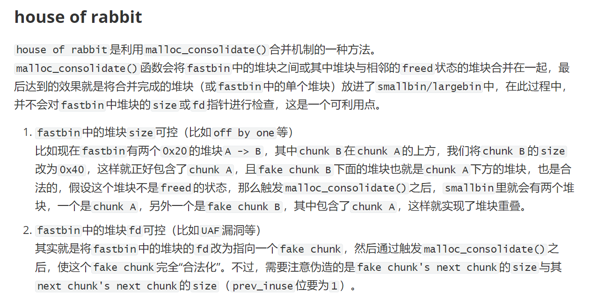

# 2.23


# 2.27


# 2.31


## `malloc_consolidate`

```c
static void malloc_consolidate(mstate av)
{
  mfastbinptr*    fb;                 /* current fastbin being consolidated */
  mfastbinptr*    maxfb;              /* last fastbin (for loop control) */
  mchunkptr       p;                  /* current chunk being consolidated */
  mchunkptr       nextp;              /* next chunk to consolidate */
  mchunkptr       unsorted_bin;       /* bin header */
  mchunkptr       first_unsorted;     /* chunk to link to */

  /* These have same use as in free() */
  mchunkptr       nextchunk;
  INTERNAL_SIZE_T size;
  INTERNAL_SIZE_T nextsize;
  INTERNAL_SIZE_T prevsize;
  int             nextinuse;

  atomic_store_relaxed (&av->have_fastchunks, false);

  unsorted_bin = unsorted_chunks(av);

  /*
    Remove each chunk from fast bin and consolidate it, placing it
    then in unsorted bin. Among other reasons for doing this,
    placing in unsorted bin avoids needing to calculate actual bins
    until malloc is sure that chunks aren't immediately going to be
    reused anyway.
  */

  maxfb = &fastbin (av, NFASTBINS - 1);
  fb = &fastbin (av, 0);
  do {
    p = atomic_exchange_acq (fb, NULL);
    if (p != 0) {
      do {
	{
	  unsigned int idx = fastbin_index (chunksize (p));
	  if ((&fastbin (av, idx)) != fb) // 检测fastbin头部这个chunk
	    malloc_printerr ("malloc_consolidate(): invalid chunk size");
	}

	check_inuse_chunk(av, p);
	nextp = p->fd;

	/* Slightly streamlined version of consolidation code in free() */
	size = chunksize (p);
	nextchunk = chunk_at_offset(p, size);
	nextsize = chunksize(nextchunk);

	if (!prev_inuse(p)) { // 前向合并后从fastbin摘下来
	  prevsize = prev_size (p);
	  size += prevsize;
	  p = chunk_at_offset(p, -((long) prevsize));
	  if (__glibc_unlikely (chunksize(p) != prevsize))
	    malloc_printerr ("corrupted size vs. prev_size in fastbins");
	  unlink_chunk (av, p);
	}

	if (nextchunk != av->top) {
	  nextinuse = inuse_bit_at_offset(nextchunk, nextsize);

	  if (!nextinuse) { // 后向合并
	    size += nextsize;
	    unlink_chunk (av, nextchunk); // 摘除
	  } else
	    clear_inuse_bit_at_offset(nextchunk, 0);

        // 加入unsortedbin的链表操作
	  first_unsorted = unsorted_bin->fd;
	  unsorted_bin->fd = p;
	  first_unsorted->bk = p;

	  if (!in_smallbin_range (size)) {
	    p->fd_nextsize = NULL;
	    p->bk_nextsize = NULL;
	  }

	  set_head(p, size | PREV_INUSE);
	  p->bk = unsorted_bin;
	  p->fd = first_unsorted;
	  set_foot(p, size);
	}

	else { // 与topchunk合并，更新topchunk header位置
	  size += nextsize;
	  set_head(p, size | PREV_INUSE);
	  av->top = p;
	}

      } while ( (p = nextp) != 0); // 遍历该idx的fastbin的所有bins

    }
  } while (fb++ != maxfb); // 遍历所有fastbin 的idx
}
```

 所以malloc_consolidate合并fastbin后，要么放入unsortedbin，要么就与topchunk合并了。

通过源码确实可以看出，malloc_consolidate对fastbin的size和fd指针都没有检查（只检查了每个idx开头的bin的size大小是否对应），所以有了**house of rabbit**的利用。


