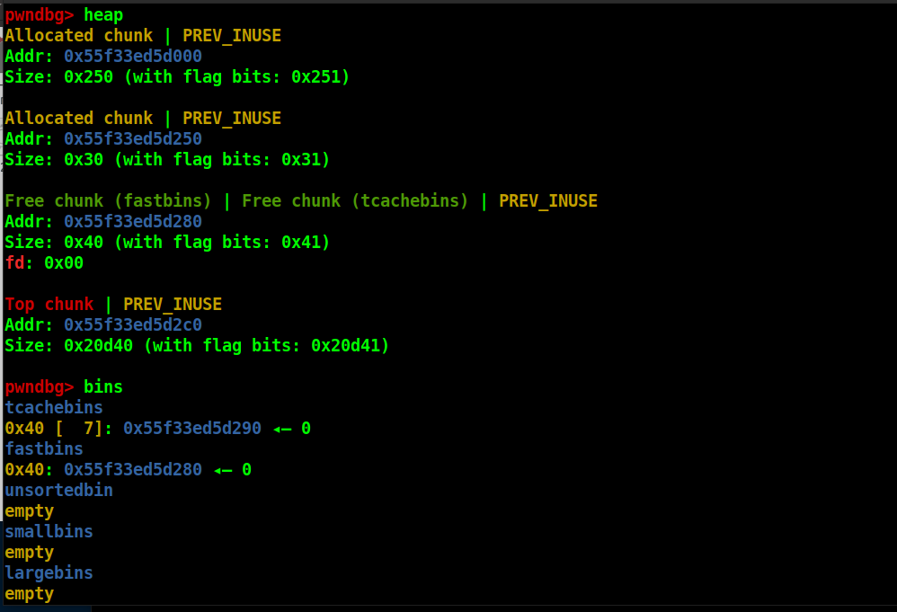

[tcache七星剑法 - 文章分类 - Jmp·Cliff - 博客园 (cnblogs.com)](https://www.cnblogs.com/JmpCliff/category/2304982.html)


tcache是**glibc 2.26(ubuntu 17.10)** 之后引入的技术 目的是提升堆的管理性能
但提升性能的同时舍弃了很多安全检查

tcache: glibc 2.26 (ubuntu 17.10) 之后引入
tcache:**glibc-2.27~glibc-2.28**无检查； **glibc-2.29~glibc-2.31** tcache有检查。

tcache会**先申请0x250的tcache_perthread_struct**

tcache**大小范围**:    **0x20 ~ 0x410**   对应malloc的size: **0x10 ~ 0x400**

每条链**7个**

64位，0x10递增，**24B~1032B**，32位，8递增，**12B~512B**

与fastbin类比，fd换成了**tcache_entry**，无bk。tcache_entry指向**用户段**

# 版本变迁

## 2.27早期

2.27-3ubuntu1的版本是没有tcache double free的key检测的，可以直接tcache dup；

比如

```
for i in range(8):
	free(0)
```



## 2.27后期

2.27后期，glibc设计者**加入key字段**，防止double free。因此tcache_entry的结构发生了变化

```c
typedef struct tcache_entry
{
  struct tcache_entry *next;
  /* This field exists to detect double frees.  */
  struct tcache_perthread_struct *key;
} tcache_entry;
```

key一般会指向**tcache_perthread_struct的mem**，如果要free的chunk的key为这个值，就会触发检查，程序会遍历链表，检查这个tcache是不是已经在里面了。

这是一个优秀的剪枝，几乎不会影响性能，非double free情况下触发这个检查的概率极低，而double free又很容易被检查出来。

先前版本我们往往会通过直接double free的方式去构造成环来劫持fd，这个改进即堵死了这条路。

需要double free的时候，一定要先破坏key指针，使其成为一个其他的值

## 2.31

2.31的变化有两个，首先是tcache_perthread_struct的counts数组的元素类型由char变成了uint16_t

```c
typedef struct tcache_perthread_struct
{
  uint16_t counts[TCACHE_MAX_BINS];
  tcache_entry *entries[TCACHE_MAX_BINS];
} tcache_perthread_struct;
```


此外，关于counts，在malloc时加入了一个新的检查，即要求counts[idx]必须要大于0。**这就意味着我们伪造fd试图从tcache中分配堆块到非法地址时，一定要确保tcache的counts仍然大于0。**

## 2.32

加入了指针异或防护，在存储next指针时，不再直接存储地址，而是存储**( pos >> 12 ) ^ ptr**这个结构，pos代表指针地址，而ptr代表在该next指针“想”指向的地址。

## 2.34

key域的值从tcache_perthread_struct变成了一个随机数。

# 相关结构体
tcache引入了两个新的结构体 `tcache_entry` 和 `tcache_perthread_struct`
与fastbin结构相似但也有区别

## tcache_entry
```c++
/* We overlay this structure on the user-data portion of a chunk when
   the chunk is stored in the per-thread cache.  */
typedef struct tcache_entry
{
  struct tcache_entry *next;
} tcache_entry;
```

`tcache_entry`用于链接空闲的chunk结构体 其中的next指针指向下一个**大小相同**的chunk
注意这里的next(理解为fd好了)指向chunk的**user data**  而fastbin的fd指针指向的是**开头部分**

(注意跟fastbin的区别)

而且`tcache_entry`会复用空闲chunk的`user data`部分

## tcache_perthread_struct
```c++
/* There is one of these for each thread, which contains the
   per-thread cache (hence "tcache_perthread_struct").  Keeping
   overall size low is mildly important.  Note that COUNTS and ENTRIES
   are redundant (we could have just counted the linked list each
   time), this is for performance reasons.  */
typedef struct tcache_perthread_struct
{
  char counts[TCACHE_MAX_BINS];
  tcache_entry *entries[TCACHE_MAX_BINS];
} tcache_perthread_struct;

# define TCACHE_MAX_BINS                64

static __thread tcache_perthread_struct *tcache = NULL;
```

每个`thread`都会维护一个`tcache_perthread_struct`，它是整个 tcache 的管理结构，
一共有 TCACHE_MAX_BINS 个计数器和 TCACHE_MAX_BINS项 tcache_entry，其中
- tcache_entry 用单向链表的方式链接了相同大小的处于空闲状态（free 后）的 chunk，这一点上和 fastbin 很像。
- counts 记录了 tcache_entry 链上空闲 chunk 的数目，每条链上最多可以有 **`7`** 个 chunk。


绕过tcache释放进入unsorted bin只需要大小**大于0x400**即可

# 基本工作方式
- 第一次 malloc 时，会先 malloc 一块内存用来存放`tcache_perthread_struct`。
- free 内存，且 size 小于`small bin size`时
- tcache 之前会放到 fastbin 或者 unsorted bin 中
- tcache 后：
  - 先放到对应的 tcache 中，直到 tcache 被填满（默认是 7 个）
  - tcache 被填满之后，再次 free 的内存和之前一样被放到 fastbin 或者 unsorted bin 中
  - tcache 中的 chunk**不会合并**（不取消 inuse bit）
- malloc 内存，且 size 在`tcache`范围内
- 先从`tcache`取 chunk，直到`tcache`为空
- tcache 为空后，从 bin 中找
- tcache 为空时，如果 fastbin/smallbin/unsorted bin 中**有 size 符合的 chunk**，
 会先把 fastbin/smallbin/unsorted bin 中的 chunk **全部**放到 tcache 中，直到填满。
  之后再从 tcache 中取；因此 chunk 在 bin 中和 tcache 中的**顺序会反过来**

# 源码分析

## `__libc_malloc`
第一次 malloc 时，会进入到 `MAYBE_INIT_TCACHE ()`
```c
void *
__libc_malloc (size_t bytes)
{
    ......
    ......
#if USE_TCACHE
  /* int_free also calls request2size, be careful to not pad twice.  */
  size_t tbytes;
  // 根据 malloc 传入的参数计算 chunk 实际大小，并计算 tcache 对应的下标
  checked_request2size (bytes, tbytes);
  size_t tc_idx = csize2tidx (tbytes);

  // 初始化 tcache
  MAYBE_INIT_TCACHE ();
  DIAG_PUSH_NEEDS_COMMENT;
  if (tc_idx < mp_.tcache_bins  // 根据 size 得到的 idx 在合法的范围内
      /*&& tc_idx < TCACHE_MAX_BINS*/ /* to appease gcc */
      && tcache
      && tcache->entries[tc_idx] != NULL) // tcache->entries[tc_idx] 有 chunk
    {
      return tcache_get (tc_idx);
    }
  DIAG_POP_NEEDS_COMMENT;
#endif
    ......
    ......
}
```

## `__tcache_init()`
其中 MAYBE_INIT_TCACHE () 在 tcache 为空（即第一次 malloc）时调用了 tcache_init()，直接查看 tcache_init()

```c
tcache_init(void)
{
  mstate ar_ptr;
  void *victim = 0;
  const size_t bytes = sizeof (tcache_perthread_struct);
  if (tcache_shutting_down)
    return;
  arena_get (ar_ptr, bytes); // 找到可用的 arena
  victim = _int_malloc (ar_ptr, bytes); // 申请一个 sizeof(tcache_perthread_struct) 大小的 chunk
  if (!victim && ar_ptr != NULL)
    {
      ar_ptr = arena_get_retry (ar_ptr, bytes);
      victim = _int_malloc (ar_ptr, bytes);
    }
  if (ar_ptr != NULL)
    __libc_lock_unlock (ar_ptr->mutex);
  /* In a low memory situation, we may not be able to allocate memory
     - in which case, we just keep trying later.  However, we
     typically do this very early, so either there is sufficient
     memory, or there isn't enough memory to do non-trivial
     allocations anyway.  */
  if (victim) // 初始化 tcache
    {
      tcache = (tcache_perthread_struct *) victim;
      memset (tcache, 0, sizeof (tcache_perthread_struct));
    }
}
```

## 申请内存
```c
  // 从 tcache list 中获取内存
  if (tc_idx < mp_.tcache_bins // 由 size 计算的 idx 在合法范围内
      /*&& tc_idx < TCACHE_MAX_BINS*/ /* to appease gcc */
      && tcache
      && tcache->entries[tc_idx] != NULL) // 该条 tcache 链不为空
    {
      return tcache_get (tc_idx);
    }
  DIAG_POP_NEEDS_COMMENT;
#endif
  // 进入与无 tcache 时类似的流程
  if (SINGLE_THREAD_P)
    {
      victim = _int_malloc (&main_arena, bytes);
      assert (!victim || chunk_is_mmapped (mem2chunk (victim)) ||
              &main_arena == arena_for_chunk (mem2chunk (victim)));
      return victim;
    }
```

## `tcache_get()`
```c
/* Caller must ensure that we know tc_idx is valid and there's
   available chunks to remove.  */
static __always_inline void *
tcache_get (size_t tc_idx)
{
  tcache_entry *e = tcache->entries[tc_idx];
  assert (tc_idx < TCACHE_MAX_BINS);
  assert (tcache->entries[tc_idx] > 0);
  tcache->entries[tc_idx] = e->next;
  --(tcache->counts[tc_idx]); // 获得一个 chunk，counts 减一
  return (void *) e;
}
```

## `__libc_free()`
```c
void
__libc_free (void *mem)
{
  ......
  ......
  MAYBE_INIT_TCACHE ();
  ar_ptr = arena_for_chunk (p);
  _int_free (ar_ptr, p, 0);
}
```

## `_int_free`
```c
static void
_int_free (mstate av, mchunkptr p, int have_lock)
{
  ......
  ......
#if USE_TCACHE
  {
    size_t tc_idx = csize2tidx (size);
    if (tcache
        && tc_idx < mp_.tcache_bins // 64
        && tcache->counts[tc_idx] < mp_.tcache_count) // 7
      {
        tcache_put (p, tc_idx);
        return;
      }
  }
#endif
  ......
  ......
}
```
判断 tc_idx 合法，tcache->counts[tc_idx] 在 7 个以内时，就进入 tcache_put()，
传递的两个参数是要释放的 chunk 和该 chunk 对应的 size 在 tcache 中的下标。

## `tcache_put()`
```c
/* Caller must ensure that we know tc_idx is valid and there's room
   for more chunks.  */
static __always_inline void
tcache_put (mchunkptr chunk, size_t tc_idx)
{
  tcache_entry *e = (tcache_entry *) chunk2mem (chunk);
  assert (tc_idx < TCACHE_MAX_BINS);
  e->next = tcache->entries[tc_idx];
  tcache->entries[tc_idx] = e;
  ++(tcache->counts[tc_idx]);
}
```
`tcache_put()`把释放的chunk插入到`tcache->entries[tc_idx]`链表头部 几乎没有任何保护

