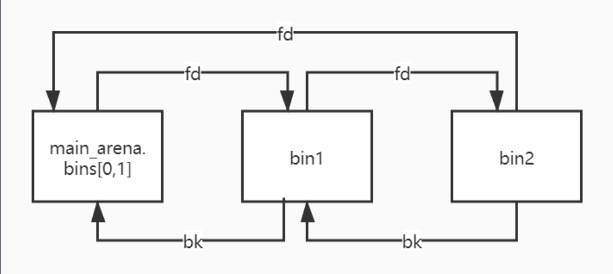
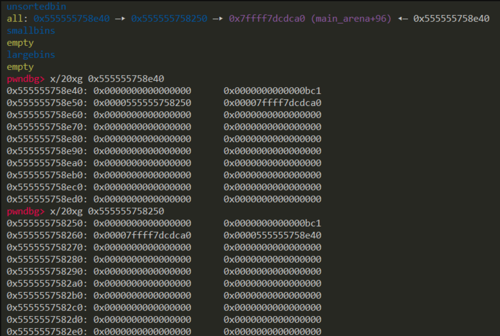
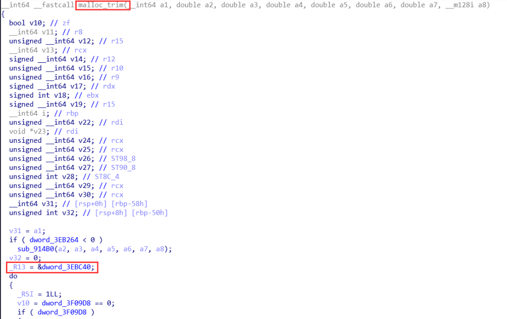
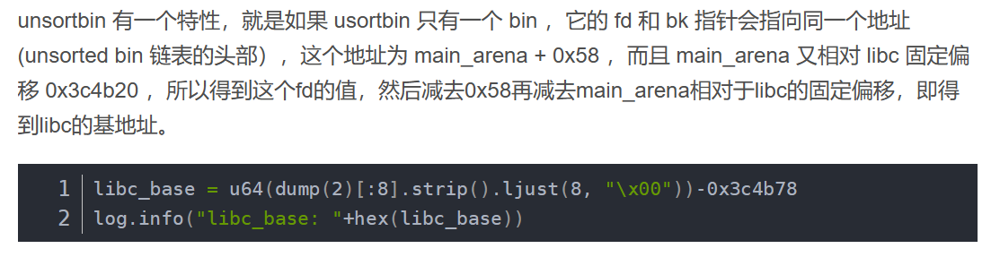

参考:
[ctfwiki](https://ctf-wiki.org/pwn/linux/user-mode/heap/ptmalloc2/unsorted-bin-attack)

# 概述
`Unsorted Bin Attack`利用前提: 能控制`unsorted bin chunk`的`bk`指针
`Unsorted Bin Attack`可达到的效果: 实现修改任意地址值为一个较大的数值

# unsorted bin回顾

## 基本来源
1. 当一个较大的chunk被分隔成两半后 如果剩下的部分大于`MINSIZE` 就会被放到unsorted bin中
2. 释放一个不属于fastbin的chunk 且该chunk不和top chunk紧邻时 该chunk会被首先放到unsorted bin 中
3. 当进行`malloc_consolidate`时 如果不和topchunk相邻 可能会把合并后的chunk放到unsorted bin中

## 基本使用情况
1. 遍历顺序为**FIFO** 插入时插入到unsorted bin的头部 取出时**从链表尾**获取

2. 在程序malloc时 如果fastbin smallbin中找不到对应大小的chunk 就会尝试从unsorted bin寻找chunk
    如果取出来的chunk大小刚好满足 就直接返回给用户

     **否则就会把这些chunk分别插入到对应的bin中**

# unsorted bin leak
!!!
很多题都用到的小trick

## unsorted bin的结构
循环双向链表


pwndbg:


可以看到 链表中必有一个节点(链表尾节点)的`fd`指针指向`main_arena`结构体内部

## leak原理
如果能leak这个fd指针 就得到与`main_arena`有固定偏移的地址 调试等方法可以得到偏移
而`main_arena`是一个`struct malloc_state`类型的全局变量 会在data段或bss段上
结合给的libc.so 就可以知道main_arena与libcbase的offset 从而绕过`ASLR`

如何获取`main_arena`与`libcbase`的offset?
两种方法:
**通过` __malloc_trim`函数得出**
malloc.c有一段代码:
```c
int
__malloc_trim (size_t s)
{
  int result = 0;

  if (__malloc_initialized < 0)
    ptmalloc_init ();

  mstate ar_ptr = &main_arena;//<=here!
  do
    {
      __libc_lock_lock (ar_ptr->mutex);
      result |= mtrim (ar_ptr, s);
      __libc_lock_unlock (ar_ptr->mutex);

      ar_ptr = ar_ptr->next;
    }
  while (ar_ptr != &main_arena);

  return result;
}
```
IDA看`&main_arena`的地址即可


**通过`__malloc_hook`直接算出**
`main_arena`和`__maloc_hook`的地址差是**0x10**
而libc一般可以直接查出`__malloc_hook`的地址
```py
main_arena_offset = ELF("libc.so.6").symbols["__malloc_hook"] + 0x10
```

这样就可以获得`main_arena`与libcbase的offset了

以64位libc-2.23.so为例


## 实现leak的方法
一般需要UAF 将一个chunk放入unsorted bin再leak其fd
对处于链表尾的节点show即可

如果unsorted bin初始是干净的 当里面只有一个bin的时候 这个bin的`fd`,`bk`都会指向`main_arena`中
如果无法访问链表尾 **32位**下可以访问链表头 用printf带出fd bk的输出
64位由于高地址一般为`\x00` 很多输出函数会被截断 该方法较难实现leak

# unsorted bin attack
**glibc-2.28后**这个攻击手段就失效了，增加了一层检查。

所以能打的只有**u16和u18**的


```c
unsorted_chunks (av)->bk = bck;          
bck->fd = unsorted_chunks (av);
```

---

**利用方法**

假设chunkA在unsorted bin中，我们通过堆溢出或者UAF伪造了chunkA的bk指针

那么上述代码的`bck->fd = unsorted_chunks (av);`

就会把 `chunkA->bk->fd`即`chunkA-bk`+0x10的内存写上unsorted bin的地址（很大的数）

所以，我们伪造chunkA->bk = target_addr - 0x10即可在目标地址写一个大数。(可以打global_max_fast之类的)

---

以how2heap的为例，


这里看看整个程序运行结果

```
This file demonstrates unsorted bin attack by write a large unsigned long value into stack
In practice, unsorted bin attack is generally prepared for further attacks, such as rewriting the global variable global_max_fast in libc for further fastbin attack

Let's first look at the target we want to rewrite on stack:
0x7ffe0d232518: 0

Now, we allocate first normal chunk on the heap at: 0x1fce010
And allocate another normal chunk in order to avoid consolidating the top chunk withthe first one during the free()

We free the first chunk now and it will be inserted in the unsorted bin with its bk pointer point to 0x7f1c705ffb78
Now emulating a vulnerability that can overwrite the victim->bk pointer
And we write it with the target address-16 (in 32-bits machine, it should be target address-8):0x7ffe0d232508

Let's malloc again to get the chunk we just free. During this time, target should has already been rewrite:
0x7ffe0d232518: 0x7f1c705ffb78
```

可以看到我们最终就将 target_addr写入了原来unsorted bin 中的chunk的bk指向的值: 0x7f1c705ffb78 (一个不可控的大数) (`main_arena+88`)
