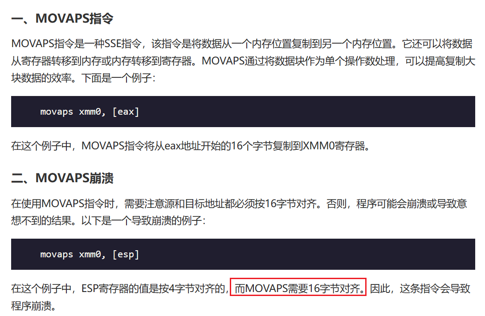

64位大于ubuntu18执行system时 都是这么写的:

```py
payload = b'a'*0x20 + b'b'*0x8 + p64(ret) + p64(system) + p64(0xdeadbeef)
```

为什么要在system前加一个ret呢?
这就涉及到栈对齐的问题
[参考](https://www.cnblogs.com/ZIKH26/articles/15996874.html)

why?
因为64位下system函数有一个**movaps指令** 这个指令要求内存地址必须**16**字节对齐


movaps:


如何才算对齐?
64位8字节 16字节进位 所以末尾非0即8


必须当地址末尾是0才算16字节对齐

没对齐:


对齐:


所以 当执行system没对齐的时候 我们通过**栈操作**指令 如 pop  ret这种来调整栈
也可以跳过system最初的`push ebp` 从下一条语句执行


分别对应payload
```py
payload = b'a'*0x20 + b'b'*0x8 + p64(ret) + p64(system) + p64(0xdeadbeef) # 返回地址

payload = b'a'*0x20 + b'b'*0x8 + p64(system+1) + p64(0xdeadbeef)
```

---
---
这算是解决了长久的疑惑... 网上找的好多要么没说原理要么瞎扯... 还得是这位师傅提到的**movaps**!
